# BÁO CÁO TỔNG HỢP ĐỒ ÁN — PHẦN MỀM QUẢN LÝ QUÁN CÀ PHÊ (QLCafe)

> **Môn:** NT106 — Lập trình mạng cơ bản · **Trường:** UIT
> **Nhóm 2:** Đào Quốc Huy (24520655) · Trà Chí Chung (24520229)
> **Loại sản phẩm:** Ứng dụng desktop WinForms (.NET 8) + REST API (Node/Express) + Realtime Chat (ASP.NET Core SignalR) + Firebase.

Tài liệu này là bản tổng hợp toàn bộ đề tài: hướng giải quyết, công nghệ, các sơ đồ thiết kế (BFD/FDD, Use Case, tuần tự, kiến trúc, luồng dữ liệu, CSDL), schema cơ sở dữ liệu, và liệt kê **chi tiết tất cả tính năng** kèm ý tưởng – cách triển khai – đoạn code thực tế. Phần cuối là **chẩn đoán lỗi sự kiện (events) gây `NullReferenceException`** mà nhóm gặp khi chạy cùng cách khắc phục, và **đợt tối ưu giao diện & hiệu năng client** (mục 12): sửa lỗi ký tự `&` hiển thị thành `_`, thay scrollbar trắng bằng thanh teal hợp theme, cache màn hình + đưa tải dữ liệu xuống luồng nền (màn Chat từ ~20 giây xuống dưới 50 ms).

---

## Mục lục

1. [Tổng quan & hướng giải quyết đề tài](#1-tổng-quan--hướng-giải-quyết-đề-tài)
2. [Công nghệ sử dụng](#2-công-nghệ-sử-dụng)
3. [Sơ đồ phân rã chức năng (BFD → FDD)](#3-sơ-đồ-phân-rã-chức-năng-bfd--fdd)
4. [Sơ đồ Use Case](#4-sơ-đồ-use-case)
5. [Sơ đồ tuần tự (Sequence)](#5-sơ-đồ-tuần-tự-sequence)
6. [Thiết kế kiến trúc hệ thống](#6-thiết-kế-kiến-trúc-hệ-thống)
7. [Thiết kế luồng dữ liệu (DFD)](#7-thiết-kế-luồng-dữ-liệu-dfd)
8. [Thiết kế cơ sở dữ liệu (ERD logic)](#8-thiết-kế-cơ-sở-dữ-liệu-erd-logic)
9. [Xây dựng cơ sở dữ liệu — Schema](#9-xây-dựng-cơ-sở-dữ-liệu--schema)
10. [Tính năng: phần CHUNG & phần RIÊNG theo từng Role](#10-tính-năng-phần-chung--phần-riêng-theo-từng-role)
    - [10.1. Tính năng CHUNG](#101-tính-năng-chung-mọi--nhiều-vai-trò)
    - [10.2. Tính năng RIÊNG theo Role](#102-tính-năng-riêng-theo-role)
11. [Chẩn đoán sự kiện (events) & lỗi NullReferenceException](#11-chẩn-đoán-sự-kiện-events--lỗi-nullreferenceexception)
12. [Tối ưu giao diện & hiệu năng client (đợt rà soát 07/2026)](#12-tối-ưu-giao-diện--hiệu-năng-client-đợt-rà-soát-072026)
13. [Kiểm thử (Testing)](#13-kiểm-thử-testing)
14. [Phụ lục A — API Reference đầy đủ](#14-phụ-lục-a--api-reference-đầy-đủ)

---

## 1. Tổng quan & hướng giải quyết đề tài

### 1.1. Bài toán

Quán cà phê có nhiều **vai trò** làm việc đồng thời (quản trị, quản lý, pha chế, order, bảo vệ) và nhiều **nghiệp vụ realtime** (đơn hàng đẩy xuống bếp, chat nội bộ, cảnh báo SOS, báo hết nguyên liệu). Một ứng dụng đơn lẻ chạy offline không đủ: dữ liệu cần đồng bộ giữa các máy, có xác thực và phân quyền, có realtime.

### 1.2. Hướng giải quyết

Nhóm chọn kiến trúc **client – server tách lớp**, vận dụng đúng trọng tâm môn *Lập trình mạng*:

| Trục | Giải pháp | Lý do |
| --- | --- | --- |
| **Giao tiếp request/response** | REST API qua HTTP (Express) | Chuẩn, dễ test (Postman/Jest), tách backend khỏi UI |
| **Giao tiếp realtime** | WebSocket qua SignalR | Chat & realtime cần server đẩy (push), HTTP polling không phù hợp |
| **Lưu trữ + xác thực** | Firebase Realtime Database + Firebase Auth | Miễn phí, realtime, có sẵn Auth/JWT, không phải dựng SQL server |
| **Giao diện** | WinForms .NET 8 + Guna.UI2 | Yêu cầu môn học là app desktop; Guna cho UI hiện đại (bo góc, dark theme) |
| **Tách lớp client** | 3 lớp **GUI → BUS → DAL → DTO** | Tái sử dụng, dễ test BUS, dễ bảo trì |

### 1.3. Nguyên tắc thiết kế xuyên suốt

- **Phân lớp nghiêm ngặt ở client:** `GUI` chỉ lo hiển thị, `BUS` lo validate + nghiệp vụ, `DAL` lo HTTP, `DTO` là object truyền dữ liệu. GUI **không** gọi thẳng HTTP.
- **Phân quyền RBAC** xác thực ở **mọi** request bằng Firebase ID Token (Bearer).
- **Bảo mật phòng thủ 2 lớp:** validate ở client (UX) **và** validate lại ở server (an toàn) — ví dụ quy tắc mật khẩu mạnh được kiểm ở cả `BUS.Validation` lẫn `auth.controller.js`.
- **UI khai báo ở Designer, logic ở `.cs`:** control/cột lưới khai trong `*.Designer.cs` (Visual Studio thấy được), còn style/dữ liệu/sự kiện xử lý trong `*.cs`.
- **Responsive:** các màn hình dùng `Anchor`/`TableLayoutPanel` để không vỡ layout khi phóng to.

---

## 2. Công nghệ sử dụng

### 2.1. Bảng công nghệ

| Thành phần | Công nghệ | Phiên bản / Ghi chú |
| --- | --- | --- |
| Client desktop | C# **WinForms**, **.NET 8** (`net8.0-windows7.0`) | UI chính cho mọi vai trò |
| Thư viện UI | **Guna.UI2.WinForms** 2.0.4.4 | Control bo góc, dark theme, DataGridView đẹp |
| Biểu đồ | **Guna.Charts.WinForms** (bản free) | Dashboard doanh thu, thống kê |
| HTTP client | `System.Net.Http.HttpClient` + **Newtonsoft.Json** | Gọi REST API |
| Realtime client | **Microsoft.AspNetCore.SignalR.Client** | Kết nối ChatHub |
| Backend API | **Node.js ≥ 18**, **Express** | REST API |
| Bảo mật HTTP | **helmet**, **cors**, **morgan** | Header an toàn, CORS, log request |
| Firebase SDK | **firebase-admin** | Truy cập Auth + Realtime DB |
| Gửi email | **nodemailer** (Gmail SMTP) | Gửi OTP đặt lại mật khẩu |
| Logging | **winston** | `combined.log`, `error.log` |
| Realtime server | **ASP.NET Core** + **SignalR** | Chat server (`/chathub`) |
| CSDL | **Firebase Realtime Database** (NoSQL JSON) | Toàn bộ dữ liệu nghiệp vụ |
| Xác thực | **Firebase Authentication** (Email/Password) | Phát ID Token (JWT) |
| Mã hóa cục bộ | **DPAPI** (`ProtectedData`) | Mã hóa mật khẩu "Ghi nhớ đăng nhập" |
| Test backend | **Jest** | Unit test controller/service |
| Test client | **xUnit** | Unit test lớp BUS |

### 2.2. Bố cục mã nguồn (3 service)

```
NT106_QuanLyQuanCafe_Nhom2/
├── client/                # WinForms (.NET 8) — GUI · BUS · DAL · DTO · Tests
├── backend/               # Express REST API (Node.js) — controllers · services · routes · middlewares
├── server/                # ASP.NET Core SignalR — ChatServer/Hubs/ChatHub.cs
├── docs/                  # Tài liệu (architecture, api, database, dataflow, forms, báo cáo này)
└── scripts/               # PowerShell khởi chạy (start-all / start-backend / start-server / start-client)
```

### 2.3. Cổng dịch vụ & giao thức

| Dịch vụ | Cổng | Giao thức | Endpoint gốc |
| --- | --- | --- | --- |
| Backend Express | **3000** | HTTP REST | `http://localhost:3000/api`, `GET /health` |
| Chat Server SignalR | **8080** | WebSocket | `http://localhost:8080/chathub` |
| Firebase RTDB | 443 | HTTPS (Admin SDK) | `…asia-southeast1.firebasedatabase.app` |
| Firebase Auth | 443 | HTTPS REST | `identitytoolkit.googleapis.com` |
| Gmail SMTP | 587 | SMTP (Nodemailer) | gửi OTP |

> Client cấu hình URL qua `App.config`: `ApiBaseUrl` (mặc định `http://localhost:3000/api/`) và `ChatServerIP` (mặc định `localhost` → `http://{IP}:8080/chathub`). Đổi IP để chạy nhiều máy trong LAN.

### 2.4. Biến môi trường backend (`backend/.env`)

| Biến | Bắt buộc | Mô tả |
| --- | --- | --- |
| `PORT` | Không | Cổng backend (mặc định 3000) |
| `FIREBASE_DATABASE_URL` | Có | URL Realtime Database |
| `FIREBASE_API_KEY` | Có | Web API Key (cho `signInWithPassword`) |
| `APP_SECRET_KEY` | Có | Bí mật bảo vệ endpoint đổi mật khẩu + `X-Server-Secret` (ChatServer ↔ Backend) |
| `EMAIL_USER` / `EMAIL_PASS` | Có | Gmail + App Password để gửi OTP |
| `NODE_ENV` | Không | `development` / `production` |

> `serviceAccountKey.json` (Firebase Admin) đặt tại `backend/`, đã `gitignore` — **không commit**.

### 2.5. Cài đặt & chạy

```powershell
.\scripts\setup.ps1                       # cài deps: npm install + dotnet restore
.\scripts\start-all.ps1 -WithClient       # Backend + ChatServer + Client (đầy đủ)
.\scripts\start-all.ps1                    # Backend + ChatServer (mặc định)
.\scripts\start-backend.ps1                # chỉ Backend (port 3000)
.\scripts\start-server.ps1                 # chỉ ChatServer (port 8080)
.\scripts\start-client.ps1                 # build + chạy GUI.exe
```
- Mở client trong Visual Studio: `client/Coffee_Management.sln` → **F5**.
- Kiểm tra nhanh backend: `curl http://localhost:3000/health` → `{"status":"ok"}`.
- Deploy backend lên Firebase Functions: `firebase deploy --only functions` → `https://asia-southeast1-<project>.cloudfunctions.net/api`.
- Script `*.ps1` lưu **UTF-8 có BOM** để Windows PowerShell 5.1 đọc đúng tiếng Việt (hoặc chạy bằng `pwsh`).

---

## 3. Sơ đồ phân rã chức năng (BFD → FDD)

### 3.1. BFD — Mức đỉnh

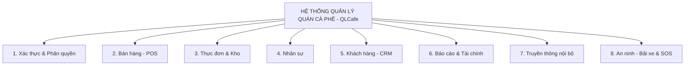

### 3.2. FDD — Phân rã chi tiết từng phân hệ

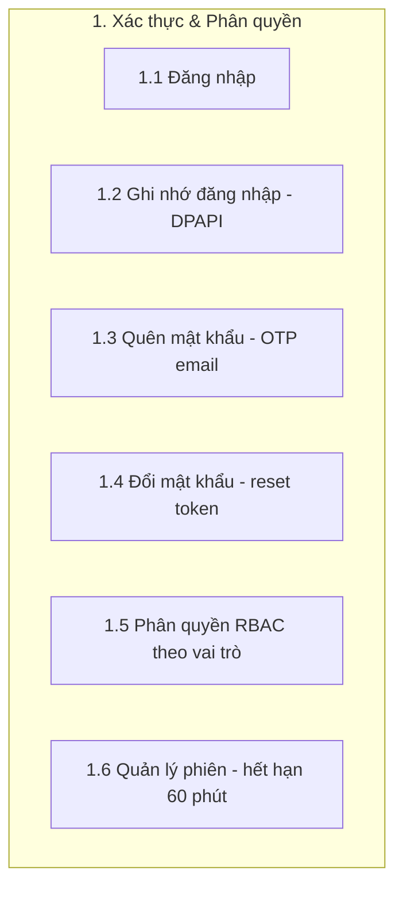

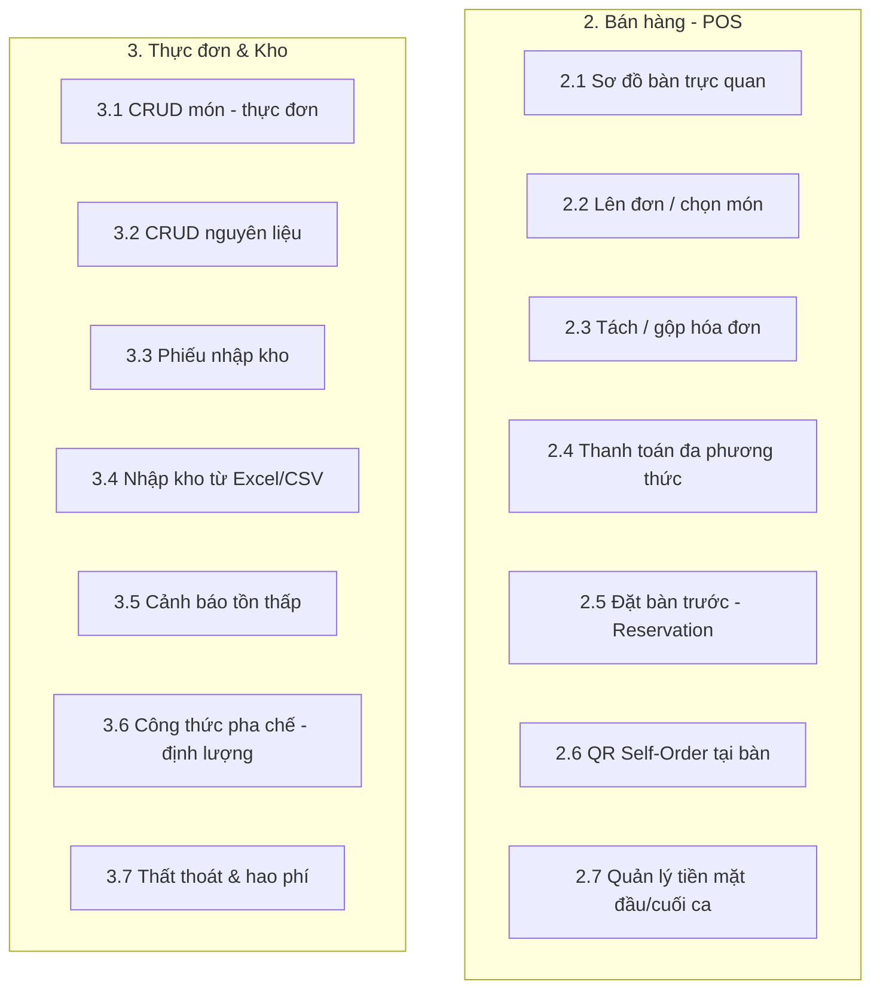

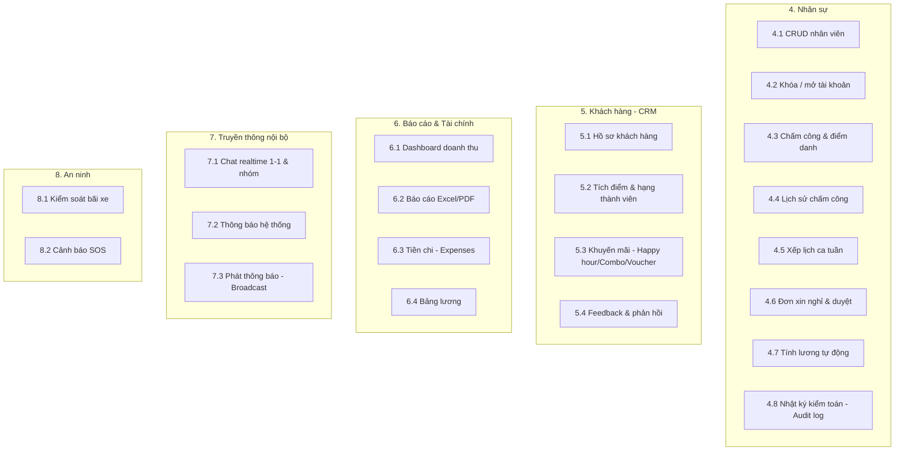

---

## 4. Sơ đồ Use Case

### 4.1. Tác nhân (Actors)

| Actor | Mô tả | Use case tiêu biểu |
| --- | --- | --- |
| **Admin** | Toàn quyền hệ thống | Quản trị Manager, lương, chi, báo cáo, audit log |
| **Manager** | Quản lý vận hành | Quản lý món+kho, đơn hàng, nhân viên, lịch ca, khuyến mãi, duyệt nghỉ |
| **Order Staff** | Nhân viên order | POS, CRM, loyalty, đặt bàn, QR self-order, tiền mặt |
| **Barista** | Pha chế | Màn hình bếp (KDS), công thức, cảnh báo NL |
| **Security** | Bảo vệ | Bãi xe, SOS |
| **Khách hàng** | Quét QR đặt món | Self-order tại bàn, để lại feedback |
| **Hệ thống (Firebase/SignalR)** | Tác nhân phụ | Xác thực token, đẩy realtime, gửi email OTP |

### 4.2. Use Case tổng quát

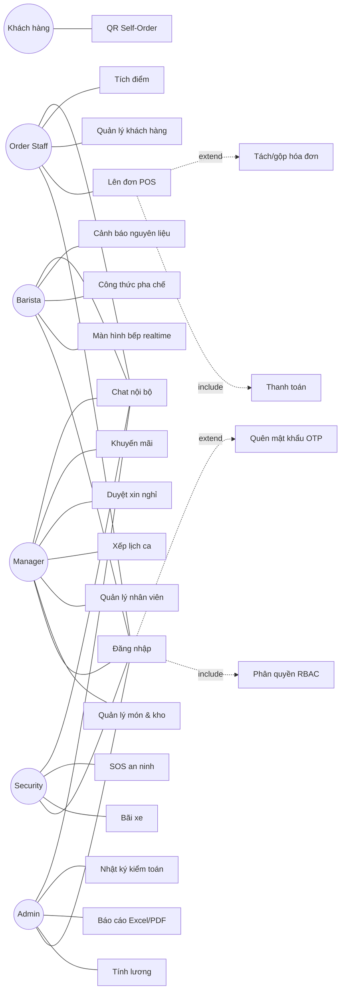

### 4.3. Đặc tả một Use Case (mẫu): **UC – Đăng nhập**

| Mục | Nội dung |
| --- | --- |
| **Tác nhân** | Mọi nhân viên |
| **Tiền điều kiện** | Tài khoản tồn tại trong `/nhan_vien`, `trang_thai = active` |
| **Luồng chính** | 1) Nhập email + mật khẩu → 2) BUS validate định dạng → 3) DAL `POST /auth/login` → 4) Backend `signInWithPassword` (Firebase Auth) → 5) Lấy hồ sơ NV từ DB → 6) Trả `{token, user}` → 7) Lưu `GlobalSession` + hạn 60 phút → 8) Mở Dashboard đúng vai trò |
| **Luồng phụ** | Sai mật khẩu → 401; Tài khoản bị khóa → báo lỗi; Quên mật khẩu → UC OTP |
| **Hậu điều kiện** | Có ID Token để đính kèm các request sau |

### 4.4. Ma trận quyền (Role × Use Case)

> ✔ = được phép · ✱ = chỉ dữ liệu của bản thân · — = không có.

| Use Case | Admin | Manager | Order | Barista | Security |
| --- | :-: | :-: | :-: | :-: | :-: |
| Đăng nhập / Đổi mật khẩu | ✔ | ✔ | ✔ | ✔ | ✔ |
| Chat nội bộ · Profile | ✔ | ✔ | ✔ | ✔ | ✔ |
| Chấm công / Lịch sử | ✔ | ✔ | ✱ | ✱ | ✱ |
| Xin nghỉ (gửi) | — | ✔ | ✔ | ✔ | ✔ |
| Duyệt xin nghỉ | ✔ | ✔ | — | — | — |
| Quản lý nhân viên (CRUD) | ✔ | ✔ | — | — | — |
| Quản lý món & kho | ✔ | ✔ | — | — | — |
| POS / Thanh toán | — | — | ✔ | — | — |
| CRM / Loyalty / Đặt bàn | — | — | ✔ | — | — |
| KDS / Công thức / Cảnh báo NL | — | — | — | ✔ | — |
| Bãi xe / SOS | — | — | — | — | ✔ |
| Tính lương · Tiền chi · Báo cáo · Audit | ✔ | — | — | — | — |
| Feedback · Thông báo · Broadcast | ✔ | ✔ | — | — | — |

> Quyền được **thực thi ở backend** qua `verifyManagerRole` (chặn 403 nếu không phải Admin/Manager) và lọc dữ liệu trong controller (`getAll` chỉ trả nhóm lãnh đạo cho NV thường) — UI ẩn menu chỉ là lớp tiện lợi, không phải lớp bảo mật.

### 4.5. Đặc tả thêm

**UC – Tạo đơn & Thanh toán (Order Staff)**

| Mục | Nội dung |
| --- | --- |
| **Tiền điều kiện** | Đã đăng nhập vai trò `order staff`; bàn ở trạng thái `trong`/`co_khach` |
| **Luồng chính** | 1) Chọn bàn → 2) Bấm card món (tải từ `/mon_uong`) → giỏ cộng dồn → 3) Nhập giảm giá → 4) Mở `PaymentDialog`, chọn phương thức → 5) Ghi `/thanh_toan`, `don_hang.trang_thai=hoan_thanh`, `ban.trang_thai=trong` → 6) Xuất hóa đơn |
| **Luồng phụ** | API món lỗi → dùng menu mock; huỷ đơn → `trang_thai=huy` |
| **Hậu điều kiện** | Có bản ghi thanh toán; bàn được giải phóng |

**UC – Nhập kho (Manager)**

| Mục | Nội dung |
| --- | --- |
| **Tiền điều kiện** | Vai trò `manager`/`admin`; có nguyên liệu trong `/nguyen_lieu` |
| **Luồng chính** | 1) Mở `WarehouseManager` → `AddInventoryImport` → 2) Chọn NV + thêm dòng NL (tay hoặc đọc Excel/CSV) → 3) BUS tính `Subtotal`/`TotalAmount` → 4) `POST /inventory` → server tính lại tiền, sinh `nk_XXX`, cộng `ton_kho` → 5) Reload bảng |
| **Luồng phụ** | Thiếu NV/không có dòng NL → BUS chặn; tồn âm → cảnh báo |
| **Hậu điều kiện** | Có phiếu `/nhap_kho`; tồn kho tăng tương ứng |

---

## 5. Sơ đồ tuần tự (Sequence)

### 5.1. Đăng nhập

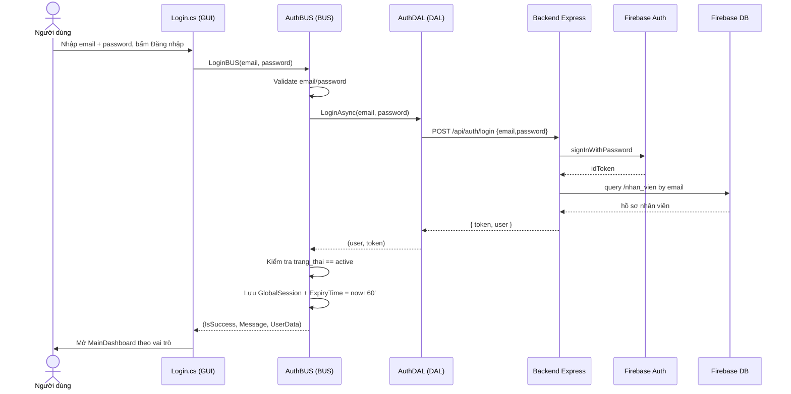

### 5.2. Quên mật khẩu (OTP + reset-token)

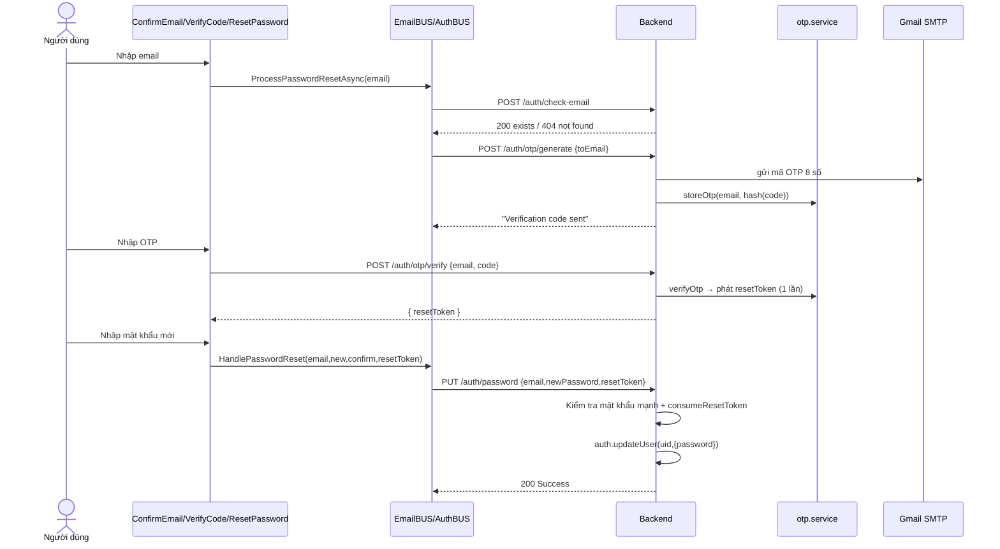

### 5.3. Chat realtime (SignalR)

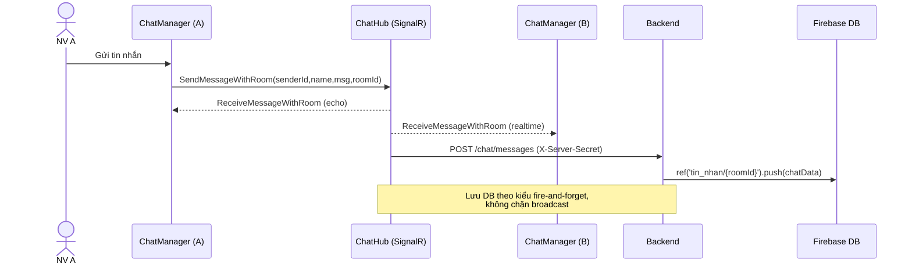

### 5.4. Nhập kho (cập nhật tồn tự động)

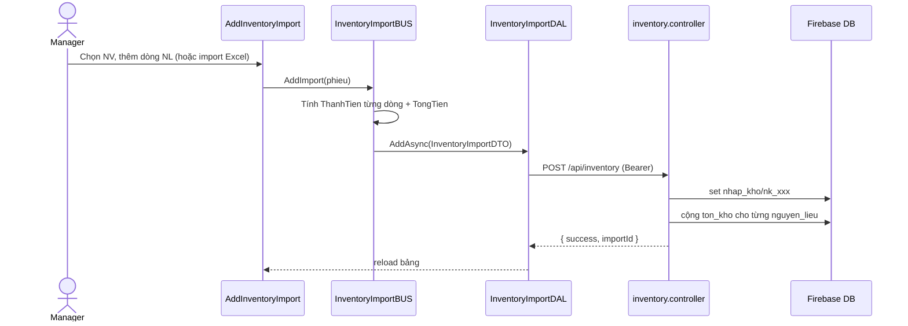

### 5.5. Thanh toán đơn hàng

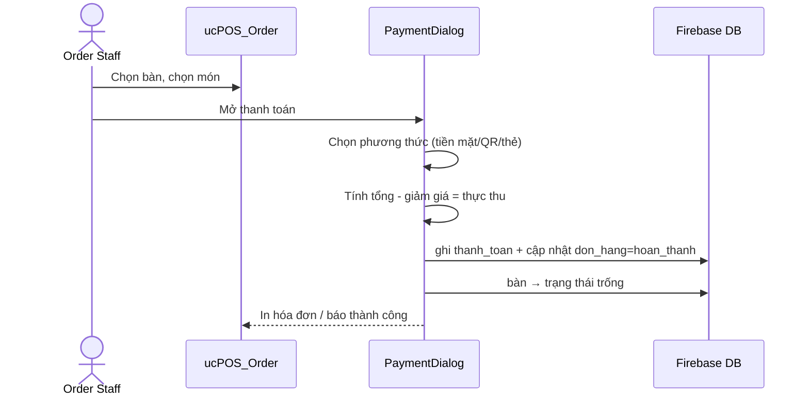

### 5.6. Thêm nhân viên (tạo Auth + rollback nếu lỗi)

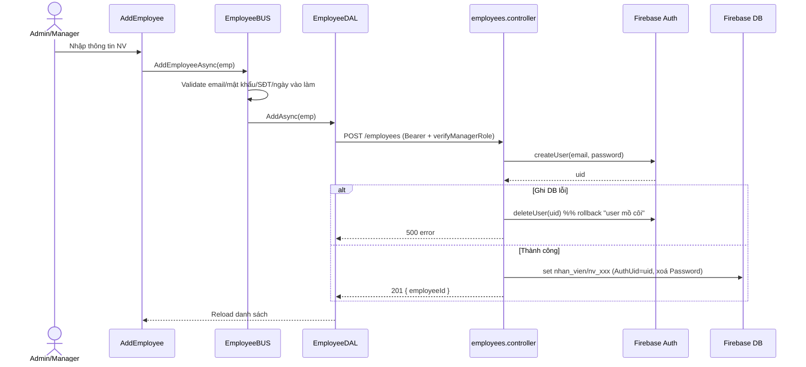

### 5.7. RBAC — kiểm quyền mỗi request

```mermaid
sequenceDiagram
    participant C as Client (DAL)
    participant MW as auth.middleware
    participant FA as Firebase Auth
    participant DB as Firebase DB
    participant H as Controller

    C->>MW: request + Authorization: Bearer <idToken>
    MW->>FA: verifyIdToken(token)
    FA-->>MW: decoded { email }
    MW->>DB: query nhan_vien theo email
    DB-->>MW: hồ sơ (vai_tro)
    alt Route cần Manager/Admin
        MW->>MW: vai_tro ∈ {manager, admin}?
        MW-->>C: 403 Forbidden (nếu không đủ quyền)
    end
    MW->>H: req.user = hồ sơ; next()
    H-->>C: kết quả
    Note over MW: ChatServer gọi nội bộ dùng X-Server-Secret thay JWT
```

### 5.8. Đổi phòng & tải lịch sử chat

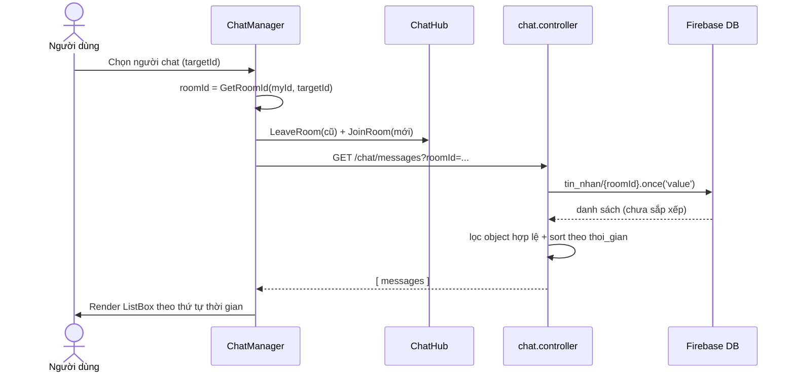

---

## 6. Thiết kế kiến trúc hệ thống

### 6.1. Sơ đồ kiến trúc tổng thể

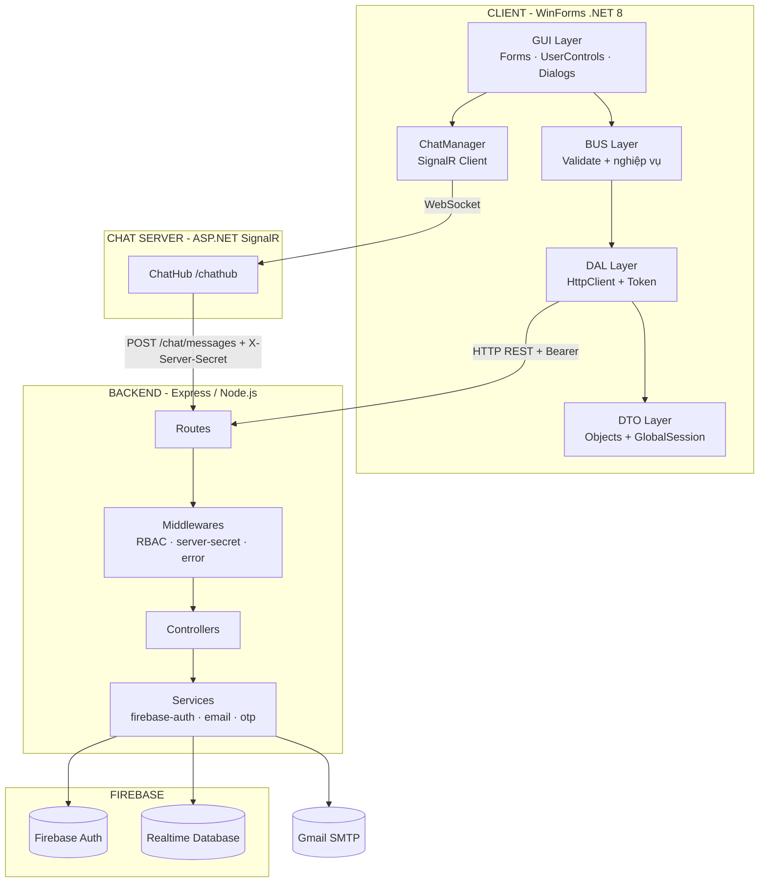

### 6.2. Phân lớp & trách nhiệm

| Lớp | Vị trí | Trách nhiệm | Không được làm |
| --- | --- | --- | --- |
| **GUI** | `client/GUI` | Hiển thị, bắt sự kiện, gọi BUS | Gọi HTTP trực tiếp, chứa nghiệp vụ |
| **BUS** | `client/BUS` | Validate, tính toán nghiệp vụ, điều phối DAL | Đụng vào WinForms |
| **DAL** | `client/DAL` | Dựng HTTP request, gắn token, parse JSON | Validate nghiệp vụ |
| **DTO** | `client/DTO` | Định nghĩa object + `GlobalSession` | Logic phức tạp |
| **Backend** | `backend/src` | REST, RBAC, xác thực Firebase, email | Giao diện |
| **ChatServer** | `server` | Realtime broadcast, lưu tin nhắn qua API | Lưu DB trực tiếp |

### 6.3. Luồng xác thực mỗi request (RBAC)

`backend/src/middlewares/auth.middleware.js`:

```js
async function verifyAndGetUser(req, res, next) {
    const authHeader = req.headers.authorization;
    if (!authHeader || !authHeader.startsWith('Bearer ')) {
        return res.status(401).json({ error: 'Unauthorized' });
    }
    const token = authHeader.split('Bearer ')[1];
    const decoded = await auth.verifyIdToken(token);          // Firebase xác thực JWT
    const employee = await _getEmployeeByEmail(decoded.email); // lấy vai trò từ DB
    req.user = employee;
    next();
}

async function verifyManagerRole(req, res, next) {
    await verifyAndGetUser(req, res, () => {
        const role = (req.user.vai_tro || '').toLowerCase();
        if (role !== 'manager' && role !== 'admin')
            return res.status(403).json({ error: 'Forbidden' });
        next();
    });
}
```

ChatServer được phép gọi nội bộ không cần JWT, dùng `X-Server-Secret`:

```js
function verifyServerSecret(req, res, next) {
    const secret = req.headers['x-server-secret'];
    if (secret && secret === process.env.APP_SECRET_KEY) {
        req.user = { EmployeeId: 'server', vai_tro: 'server' };
        return next();
    }
    return res.status(401).json({ error: 'Unauthorized' });
}
```

---

## 7. Thiết kế luồng dữ liệu (DFD)

### 7.1. DFD mức ngữ cảnh (Level 0)

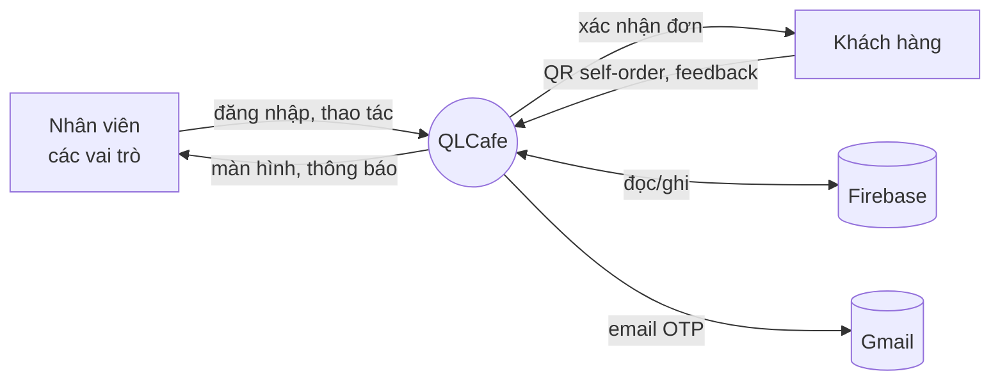

### 7.2. DFD mức 1 (các tiến trình chính)

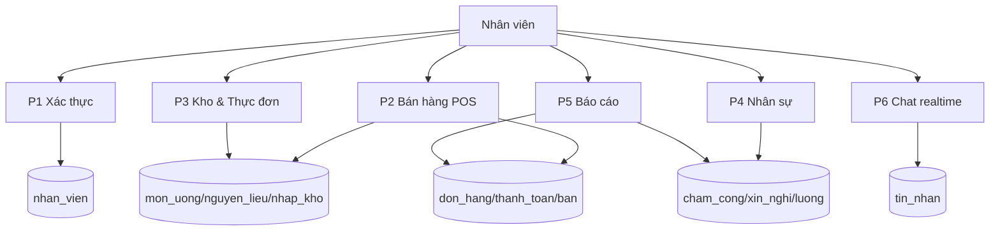

### 7.3. Luồng dữ liệu xuyên lớp ở client (chuẩn lặp lại)

```
GUI (sự kiện) → BUS (validate + nghiệp vụ) → DAL (DalHelper.Build + HttpClient)
      → Backend (middleware → controller → service) → Firebase
      ← JSON ← DAL (parse) ← BUS (map DTO) ← GUI (bind DataGridView)
```

`client/DAL/DalHelper.cs` — điểm tập trung dựng request + đính token:

```csharp
internal static HttpRequestMessage Build(HttpMethod method, string relativeUrl, object? body = null)
{
    var request = new HttpRequestMessage(method, BaseUrl + relativeUrl);
    if (!string.IsNullOrEmpty(GlobalSession.Token))
        request.Headers.Authorization = new AuthenticationHeaderValue("Bearer", GlobalSession.Token);
    if (body != null)
        request.Content = new StringContent(
            JsonConvert.SerializeObject(body), Encoding.UTF8, "application/json");
    return request;
}
```

### 7.4. DFD mức 2 — P1 Xác thực

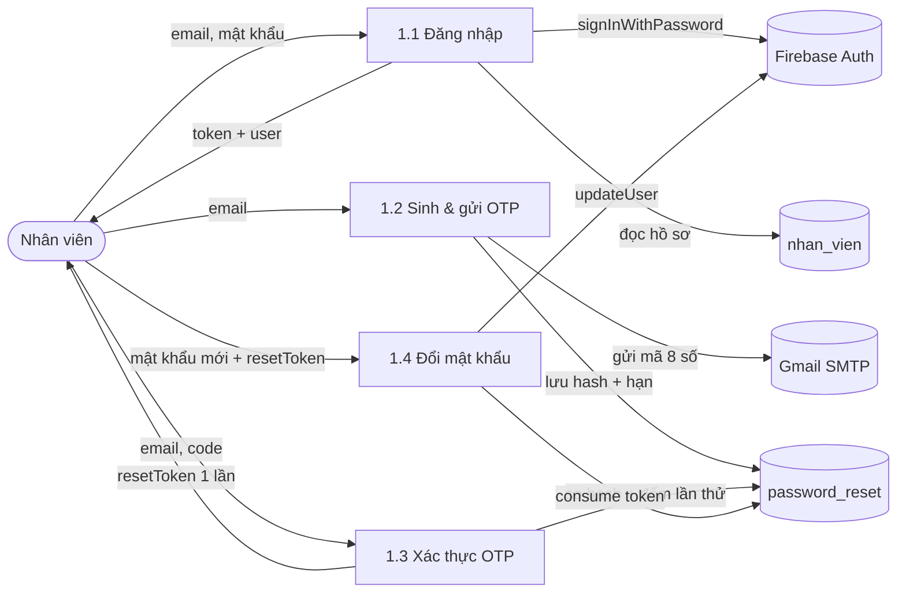

### 7.5. DFD mức 2 — P2 Bán hàng (POS)

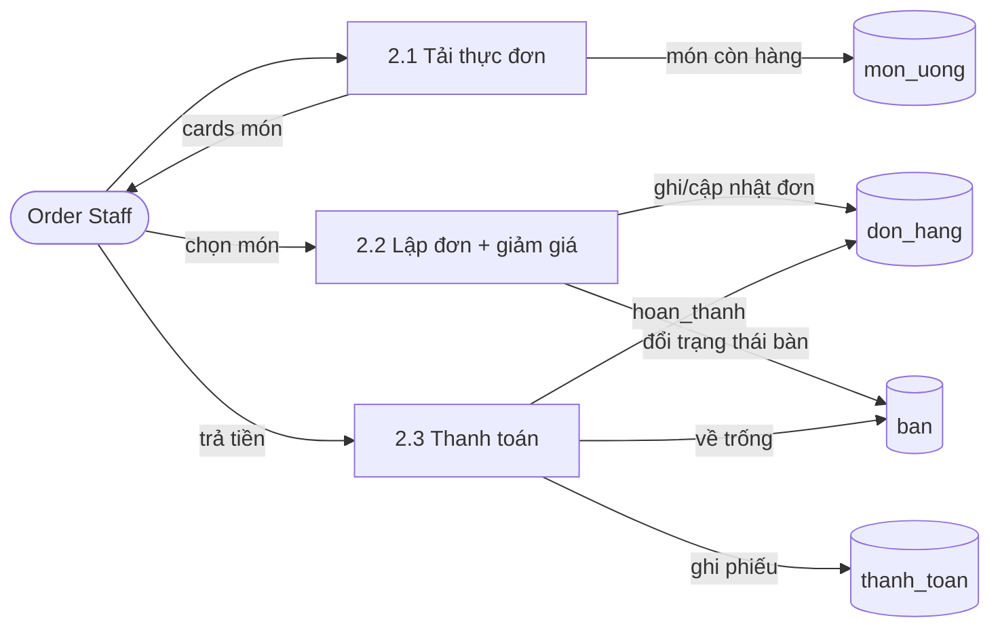

### 7.6. DFD mức 2 — P3 Kho

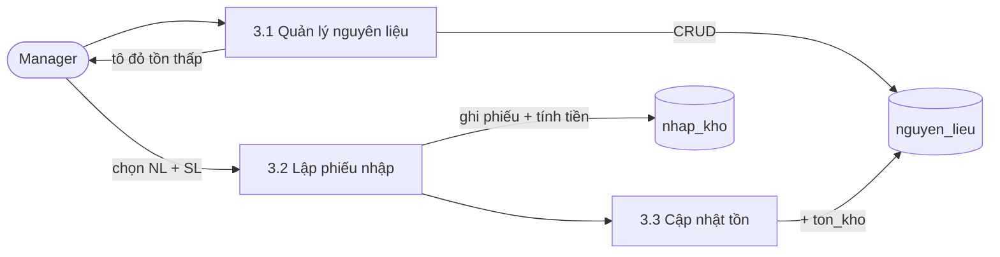

### 7.7. DFD mức 2 — P4 Nhân sự

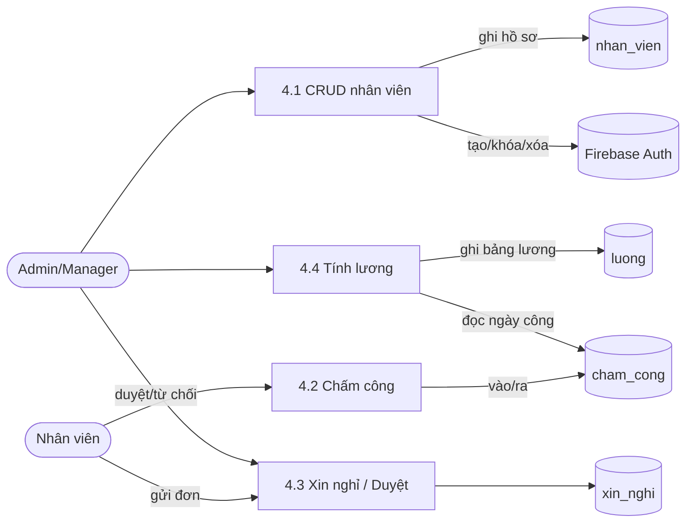

### 7.8. DFD mức 2 — P6 Chat realtime

```mermaid
flowchart LR
    A([NV A])
    B([NV B])
    P61[6.1 Gửi tin]
    P62[6.2 Broadcast room]
    P63[6.3 Lưu tin nhắn]
    P64[6.4 Tải lịch sử]
    DBT[(tin_nhan)]

    A -->|tin nhắn| P61
    P61 --> P62
    P62 -->|realtime| B
    P62 -->|fire-and-forget| P63
    P63 --> DBT
    B -->|mở phòng| P64
    P64 -->|đọc + sort| DBT
    P64 -->|lịch sử| B
```

---

## 8. Thiết kế cơ sở dữ liệu (ERD logic)

CSDL thực tế là **Firebase Realtime Database** (NoSQL — một cây JSON khổng lồ). Không có khái niệm "bảng/khóa ngoại" như SQL; thay vào đó mỗi **node gốc** (vd `/nhan_vien`) đóng vai trò một "bảng", *key* của mỗi phần tử là **khóa chính** (vd `nv_001`), còn quan hệ thể hiện bằng cách **lưu key của node khác làm giá trị** (vd `don_hang.ban_id = "ban_001"`). Một số quan hệ 1-n được **lồng (nested)** trực tiếp (vd `chi_tiet_don` nằm trong `don_hang`).

Dưới đây là **mô hình thực thể logic** (quy về kiểu quan hệ cho dễ đọc), tách làm 2 cụm cho rõ.

### 8.1. ERD cụm Bán hàng – Thực đơn – Kho

```mermaid
erDiagram
    NHAN_VIEN  ||--o{ DON_HANG    : "tạo"
    BAN        ||--o{ DON_HANG    : "phục vụ"
    DON_HANG   ||--|{ CHI_TIET_DON: "gồm (nested)"
    MON_UONG   ||--o{ CHI_TIET_DON: "xuất hiện trong"
    DON_HANG   ||--o| THANH_TOAN  : "được thanh toán"
    NHAN_VIEN  ||--o{ THANH_TOAN  : "thu ngân"
    MON_UONG   ||--o| CONG_THUC   : "có công thức"
    NGUYEN_LIEU||--o{ CT_NGUYEN_LIEU : "dùng trong"
    CONG_THUC  ||--|{ CT_NGUYEN_LIEU : "định lượng (nested)"
    NHAN_VIEN  ||--o{ NHAP_KHO    : "lập phiếu"
    NHAP_KHO   ||--|{ NK_CHI_TIET : "gồm (nested ds_nl)"
    NGUYEN_LIEU||--o{ NK_CHI_TIET : "được nhập"
    KHACH_HANG ||--o{ FEEDBACK    : "để lại"
    DON_HANG   ||--o| FEEDBACK    : "kèm theo"

    NHAN_VIEN {
        string nv_id PK "key node, vd nv_001"
        string AuthUid "uid Firebase Auth"
        string email
        string ho_ten
        string so_dien_thoai
        string ngay_vao_lam
        string vai_tro "admin|manager|order staff|barista|security"
        string trang_thai "active|inactive"
        string avatar_url
    }
    MON_UONG {
        string mon_id PK
        string ten_mon
        decimal gia
        string loai "cafe|tra|do_uong..."
        string mo_ta
        string hinh_anh_url
        bool con_hang
        bool hien_thi
    }
    BAN {
        string ban_id PK
        string ten_ban
        int so_cho
        string trang_thai "trong|co_khach|dat_truoc"
        string vi_tri
    }
    DON_HANG {
        string dh_id PK
        string ban_id FK
        string nhanvien_id FK
        long thoi_gian_tao "ms"
        string trang_thai "pending|dang_phuc_vu|hoan_thanh|huy"
        string ghi_chu
    }
    CHI_TIET_DON {
        string ctd_id PK "nested trong don_hang"
        string mon_id FK
        int so_luong
        decimal don_gia
        string ghi_chu_mon
        string trang_thai_che_bien "cho|dang_lam|hoan_thanh"
    }
    THANH_TOAN {
        string tt_id PK
        string don_hang_id FK
        string nhanvien_id FK
        string phuong_thuc "tien_mat|momo|vnpay|chuyen_khoan"
        long thoi_gian "ms"
        decimal tong_tien
        decimal tien_giam
        decimal tien_thuc_thu
    }
    NGUYEN_LIEU {
        string nl_id PK
        string ten_nguyen_lieu
        string don_vi "kg|lit|cai..."
        long gia_nhap
        double ton_kho
        double ton_kho_toi_thieu
    }
    NHAP_KHO {
        string nk_id PK
        string nhanvien_id FK
        long ngay_nhap "ms"
        string ghi_chu
        long thanh_tien
    }
    NK_CHI_TIET {
        string nl_id PK "nested ds_nl, key = nl_id"
        long gia_nhap
        int so_luong
        long thanh_tien
    }
    CONG_THUC {
        string ct_id PK
        string ten_mon
        string loai "ca_phe|tra|sinh_to|khac"
        string mon_id FK
        string cac_buoc
    }
    CT_NGUYEN_LIEU {
        string nl_key PK "nested nguyen_lieu"
        string ten
        string dinh_luong "25ml|200g"
        string loai "chinh|phu|topping|trang_tri"
        string nguyen_lieu_id FK
    }
    KHACH_HANG {
        string kh_id PK
        string ten_khach_hang
        string so_dien_thoai
        string email
        int diem_tich_luy
        int tong_don
        long ngay_tao
    }
    FEEDBACK {
        string fb_id PK
        string ten_khach
        int so_sao "1-5"
        string noi_dung
        bool da_xu_ly
        string nguoi_xu_ly_id FK
        string phan_hoi
        string don_hang_id FK
    }
```

### 8.2. ERD cụm Nhân sự – Truyền thông – An ninh

```mermaid
erDiagram
    NHAN_VIEN ||--o{ CHAM_CONG  : "chấm công"
    NHAN_VIEN ||--o{ XIN_NGHI   : "gửi đơn"
    NHAN_VIEN ||--o{ XIN_NGHI   : "duyệt"
    NHAN_VIEN ||--o{ LUONG      : "nhận lương"
    NHAN_VIEN ||--o{ THONG_BAO  : "nhận thông báo"
    NHAN_VIEN ||--o{ TIN_NHAN   : "gửi tin nhắn"
    NHAN_VIEN ||--o{ BAI_XE     : "ghi nhận"
    NHAN_VIEN ||--o{ SU_CO      : "báo sự cố"
    NHAN_VIEN ||--o{ CANH_BAO   : "tạo cảnh báo"
    NGUYEN_LIEU ||--o{ CANH_BAO : "liên quan"

    CHAM_CONG {
        string cc_id PK
        string nhanvien_id FK
        string ngay "yyyy-MM-dd"
        long gio_vao "ms"
        long gio_ra "ms"
        double so_gio_lam
        string trang_thai "du_gio|di_muon|ve_som|nua_ca|nghi_phep|vang_mat"
        string ghi_chu
    }
    XIN_NGHI {
        string xn_id PK
        string nhanvien_id FK
        string tu_ngay "dd/MM/yyyy"
        string den_ngay
        int so_ngay
        string ly_do
        string trang_thai "cho_duyet|da_duyet|tu_choi"
        long thoi_gian_gui
        string nguoi_duyet_id FK
        long thoi_gian_duyet
        string ghi_chu_duyet
    }
    LUONG {
        string luong_id PK
        string nhanvien_id FK
        int thang
        int nam
        int ngay_cong
        decimal luong_co_ban
        decimal phu_cap
        decimal thuong_feedback
        decimal thuong_le
        decimal tru_luong
        string ly_do_tru
        decimal tong_luong
        string trang_thai "chua_duyet|da_duyet|da_tra"
        long ngay_tinh
    }
    THONG_BAO {
        string tb_id PK
        string loai "don_moi|xin_nghi|sua_nguyen_lieu|feedback_xau|cham_cong|sos"
        string noi_dung
        string nguoi_gui_id FK
        string nguoi_nhan_id FK
        long thoi_gian
        bool da_doc
        string don_hang_id FK
        string trang_lien_quan "order|leave|stock|feedback|attendance|security"
    }
    TIN_NHAN {
        string msg_key PK "trong room: chat_nv_x_nv_y"
        string nguoi_gui_id FK
        string ten_nguoi_gui
        string noi_dung
        string loai_tin_nhan "text|image"
        long thoi_gian
    }
    BAI_XE {
        string bx_id PK
        string bien_so
        string loai_xe "xe_may|o_to|xe_dap"
        long gio_vao
        long gio_ra "0 = chưa ra"
        string trang_thai "dang_gui|da_ra"
        string nhanvien_id FK
        decimal phi_gui
    }
    SU_CO {
        string sc_id PK
        string loai_su_co "an_ninh|y_te|ky_thuat|chay_no|sos_khan_cap|khac"
        string mo_ta
        string nguoi_bao_id FK
        long thoi_gian
        string trang_thai "cho_xu_ly|dang_xu_ly|da_xu_ly"
        string ghi_chu_xu_ly
        string muc_do "thuong|nghiem_trong|khan_cap"
    }
    CANH_BAO {
        string cb_id PK
        string loai "het_nguyen_lieu|sap_het|thiet_bi_hong"
        string noi_dung
        string nguoi_gui_id FK
        long thoi_gian
        string trang_thai "cho_xu_ly|da_xu_ly"
        string nguyen_lieu_id FK
    }
```

### 8.3. Danh mục thực thể (đang có vs sẽ có)

> Một số node được dựng cho các tính năng **mở rộng** (CRM, lương, nghỉ phép, bãi xe, sự cố, công thức) — đánh dấu 🆕. Các node lõi đã có dữ liệu thật đánh dấu 🟢.

| Node Firebase | Tiền tố key | Trạng thái | DTO ánh xạ (client) | Phục vụ màn |
| --- | --- | --- | --- | --- |
| `/nhan_vien` | `nv_` | 🟢 Đang có | `EmployeeDTO` | Đăng nhập, Nhân viên |
| `/mon_uong` | `mon_` | 🟢 Đang có | `FoodDTO` | Thực đơn, POS |
| `/ban` | `ban_` | 🟢 Đang có | `TableDTO` | Sơ đồ bàn (POS) |
| `/don_hang` (+`chi_tiet_don`) | `dh_` / `ctd_` | 🟢 Đang có | `OrderDTO` / `OrderItemDTO` | POS, KDS, Đơn hàng |
| `/thanh_toan` | `tt_` | 🟢 Đang có | `PaymentDTO` | Thanh toán, Tiền mặt |
| `/nguyen_lieu` | `nl_` | 🟢 Đang có | `IngredientDTO` | Kho, Cảnh báo NL |
| `/nhap_kho` (+`ds_nl`) | `nk_` | 🟢 Đang có | `InventoryImportDTO` / `…ItemDTO` | Nhập kho |
| `/cham_cong` | `cc_` | 🟢 Đang có | `AttendanceDTO` | Chấm công, Lịch sử |
| `/thong_bao` | `tb_` | 🟢 Đang có | `NotificationDTO` | Thông báo |
| `/tin_nhan` | room/`msg_` | 🟢 Đang có | `ChatMessageDTO` | Chat nội bộ |
| `/danh_sach_chat` | `nv_` | 🟢 Đang có | (index hội thoại) | Danh sách chat |
| `/canh_bao` | `cb_` | 🟢 Đang có | `WarningDTO` | Báo động NL (Barista) |
| `/luong` | `luong_` | 🆕 Mới | `SalaryDTO` | Tiền lương (Admin) |
| `/xin_nghi` | `xn_` | 🆕 Mới | `LeaveRequestDTO` | Xin nghỉ / Duyệt |
| `/feedback` | `fb_` | 🆕 Mới | `FeedbackDTO` | Feedback |
| `/khach_hang` | `kh_` | 🆕 Mới | `CustomerDTO` | CRM, Loyalty |
| `/bai_xe` | `bx_` | 🆕 Mới | `ParkingDTO` | Bãi xe (Security) |
| `/su_co` | `sc_` | 🆕 Mới | `IncidentDTO` | SOS (Security) |
| `/cong_thuc` (+`nguyen_lieu`) | `ct_` | 🆕 Mới | `RecipeDTO` / `RecipeIngredientDTO` | Cẩm nang pha chế |

---

## 9. Xây dựng cơ sở dữ liệu — Schema

### 9.0. Nền tảng & quy ước chung

- **Loại CSDL:** Firebase Realtime Database (NoSQL JSON tree).
- **Base URL:** `https://qlcafe-b621b-default-rtdb.asia-southeast1.firebasedatabase.app/`
- **Xác thực:** Firebase Authentication (Email/Password) — phát ID Token (JWT) đính kèm mọi request REST.
- **Khóa chính = key của node**, đặt theo tiền tố nghiệp vụ; ID kế tiếp = `max(số trong key) + 1` (xem `foods/inventory/employees.controller`).

| Node | Tiền tố | Ví dụ | | Node | Tiền tố | Ví dụ |
| --- | --- | --- | --- | --- | --- | --- |
| `nhan_vien` | `nv_` | `nv_001` | | `luong` | `luong_` | `luong_001` |
| `mon_uong` | `mon_` | `mon_001` | | `cong_thuc` | `ct_` | `ct_001` |
| `ban` | `ban_` | `ban_001` | | `canh_bao` | `cb_` | `cb_001` |
| `don_hang` | `dh_` | `dh_001` | | `khach_hang` | `kh_` | `kh_001` |
| `chi_tiet_don` | `ctd_` | `ctd_001` | | `feedback` | `fb_` | `fb_001` |
| `thanh_toan` | `tt_` | `tt_001` | | `bai_xe` | `bx_` | `bx_001` |
| `nguyen_lieu` | `nl_` | `nl_001` | | `su_co` | `sc_` | `sc_001` |
| `nhap_kho` | `nk_` | `nk_001` | | `cham_cong` | `cc_` | `cc_001` |
| `thong_bao` | `tb_` | `tb_001` | | `xin_nghi` | `xn_` | `xn_001` |
| `tin_nhan` | `msg_` (sub-key) | `msg_1713245000000` | | | | |

**Quy ước kiểu dữ liệu (rất quan trọng — đã từng gây bug):**
- Mốc thời gian sự kiện (`thoi_gian`, `gio_vao`, `ngay_nhap`, `thoi_gian_tao`…) lưu **timestamp Unix mili-giây** (`long`), **không** lưu chuỗi `dd/MM/yyyy`.
- Ngày "logic" (`cham_cong.ngay`) lưu chuỗi `yyyy-MM-dd`; còn `xin_nghi.tu_ngay/den_ngay` lưu chuỗi `dd/MM/yyyy` (hiển thị).
- Tiền lưu dạng **số** (`decimal/long`), không format sẵn dấu phẩy.
- `tru_luong` (trừ lương) quy ước lưu **số dương** = số tiền bị trừ.

> Mỗi DTO ở client gắn `[JsonProperty("ten_field_firebase")]` để map tên C# (PascalCase) ↔ tên field Firebase (snake_case tiếng Việt). Các bảng "Ánh xạ DTO" dưới đây liệt kê đầy đủ cặp ánh xạ đó.

---

### 9.1. Nhân sự & Xác thực

#### `/nhan_vien` — Nhân viên (`EmployeeDTO`)
```json
"nv_001": {
  "AuthUid": "firebase_auth_uid",
  "email": "nv@cafe.com",
  "ho_ten": "Nguyễn Văn A",
  "so_dien_thoai": "0901234567",
  "ngay_vao_lam": "2026-04-05",
  "avatar_url": "",
  "trang_thai": "active",          // "active" | "inactive"
  "vai_tro": "manager"             // "admin" | "manager" | "order staff" | "barista" | "security"
}
```
| Field Firebase | Thuộc tính C# | Kiểu | Ghi chú |
| --- | --- | --- | --- |
| (key) | `EmployeeId` | string | `nv_001` |
| `AuthUid` | `AuthUid` | string | uid Firebase Auth — để khóa/xóa tài khoản |
| `email` | `Email` | string | Không cho sửa qua PUT |
| `ho_ten` | `FullName` | string | |
| `so_dien_thoai` | `PhoneNumber` | string | regex `0[35789]\d{8}` |
| `ngay_vao_lam` | `HireDate` | string | `yyyy-MM-dd`, ≤ hôm nay |
| `avatar_url` | `AvatarUrl` | string | |
| `trang_thai` | `Status` | string | đăng nhập yêu cầu `active` |
| `vai_tro` | `Role` | string | quyết định menu dashboard |
| — | `Password` | string | chỉ gửi khi **tạo**, server `delete` trước khi lưu DB |

#### `/cham_cong` — Chấm công (`AttendanceDTO`)
```json
"cc_001": {
  "nhanvien_id": "nv_001",
  "ngay": "2026-03-31",
  "gio_vao": 1711846800000,
  "gio_ra": 1711875600000,
  "so_gio_lam": 8,
  "trang_thai": "du_gio",          // "du_gio" | "di_muon" | "ve_som" | "nua_ca" | "nghi_phep" | "vang_mat"
  "ghi_chu": "Ca sáng"
}
```

#### `/xin_nghi` — Đơn xin nghỉ 🆕 (`LeaveRequestDTO`)
```json
"xn_001": {
  "nhanvien_id": "nv_007",
  "tu_ngay": "15/04/2026",
  "den_ngay": "16/04/2026",
  "so_ngay": 2,
  "ly_do": "Việc gia đình",
  "trang_thai": "cho_duyet",       // "cho_duyet" | "da_duyet" | "tu_choi"
  "thoi_gian_gui": 1744617600000,
  "nguoi_duyet_id": "nv_006",
  "thoi_gian_duyet": 1744624800000,
  "ghi_chu_duyet": ""
}
```

#### `/luong` — Bảng lương 🆕 (`SalaryDTO`)
```json
"luong_001": {
  "nhanvien_id": "nv_001",
  "thang": 4, "nam": 2026,
  "ngay_cong": 26,
  "luong_co_ban": 12000000,
  "phu_cap": 2000000,
  "thuong_feedback": 1500000,
  "thuong_le": 500000,
  "tru_luong": 0,                  // số DƯƠNG = số tiền trừ
  "ly_do_tru": "",
  "tong_luong": 16000000,
  "trang_thai": "da_duyet",        // "chua_duyet" | "da_duyet" | "da_tra"
  "ngay_tinh": 1746230400000
}
```
| Field | C# | | Field | C# |
| --- | --- | --- | --- | --- |
| `thang/nam` | `Month/Year` | | `thuong_le` | `HolidayBonus` |
| `ngay_cong` | `WorkDays` | | `tru_luong` | `Deduction` |
| `luong_co_ban` | `BaseSalary` | | `ly_do_tru` | `DeductionReason` |
| `phu_cap` | `Allowance` | | `tong_luong` | `TotalSalary` |
| `thuong_feedback` | `FeedbackBonus` | | `ngay_tinh` | `CalculatedAt` |

---

### 9.2. Bán hàng

#### `/ban` — Bàn (`TableDTO`)
```json
"ban_001": { "ten_ban": "Bàn 1", "so_cho": 4, "trang_thai": "trong", "vi_tri": "Tầng 1" }
// trang_thai: "trong" | "co_khach" | "dat_truoc"
```

#### `/don_hang` — Đơn hàng + chi tiết lồng (`OrderDTO` / `OrderItemDTO`)
```json
"dh_001": {
  "ban_id": "ban_001",
  "nhanvien_id": "nv_001",
  "thoi_gian_tao": 1711900000000,
  "trang_thai": "pending",         // "pending" | "dang_phuc_vu" | "hoan_thanh" | "huy"
  "ghi_chu": "Khách yêu cầu mang ra nhanh",
  "chi_tiet_don": {
    "ctd_001": {
      "mon_id": "mon_001",
      "so_luong": 2,
      "don_gia": 25000,
      "ghi_chu_mon": "1 ly ít đá",
      "trang_thai_che_bien": "cho" // "cho" | "dang_lam" | "hoan_thanh"
    }
  }
}
```
> Quan hệ 1-n `đơn → chi tiết` **lồng** trong `chi_tiet_don` (không tách node riêng) — đọc 1 lần lấy cả đơn. `trang_thai_che_bien` chính là dữ liệu màn **KDS** (Barista) dùng.

#### `/thanh_toan` — Thanh toán (`PaymentDTO`)
```json
"tt_001": {
  "don_hang_id": "dh_001",
  "nhanvien_id": "nv_001",
  "phuong_thuc": "tien_mat",       // "tien_mat" | "momo" | "vnpay" | "chuyen_khoan"
  "thoi_gian": 1711903600000,
  "tong_tien": 50000,
  "tien_giam": 0,
  "tien_thuc_thu": 50000           // = tong_tien − tien_giam
}
```

---

### 9.3. Thực đơn & Kho

#### `/mon_uong` — Thực đơn (`FoodDTO`)
```json
"mon_001": {
  "ten_mon": "Cà Phê Đen",
  "gia": 25000,
  "loai": "cafe",                  // "do_uong" | "tra" | "cafe" ...
  "mo_ta": "Cà phê đen đá không đường",
  "hinh_anh_url": "",
  "con_hang": true,
  "hien_thi": true
}
```

#### `/nguyen_lieu` — Nguyên liệu (`IngredientDTO`)
```json
"nl_001": {
  "ten_nguyen_lieu": "Cà phê hạt",
  "don_vi": "kg",
  "gia_nhap": 150000,
  "ton_kho": 15,                   // double — chứa số lẻ (2.2 kg, 1.5 lít)
  "ton_kho_toi_thieu": 5           // ton_kho < ton_kho_toi_thieu => cảnh báo đỏ
}
```

#### `/nhap_kho` — Phiếu nhập kho + chi tiết lồng (`InventoryImportDTO`)
```json
"nk_001": {
  "nhanvien_id": "nv_001",
  "ngay_nhap": 1711900000000,      // ⚠ timestamp ms, KHÔNG phải DDMMYYYY
  "ghi_chu": "Nhập đầu tháng",
  "thanh_tien": 1500000,           // = Σ ds_nl.thanh_tien (server tính lại)
  "ds_nl": {
    "nl_001": { "gia_nhap": 150000, "so_luong": 10, "thanh_tien": 1500000 }
  }
}
```

#### `/cong_thuc` — Công thức pha chế 🆕 (`RecipeDTO` / `RecipeIngredientDTO`)
```json
"ct_001": {
  "ten_mon": "Cà phê sữa đá",
  "loai": "ca_phe",                // "ca_phe" | "tra" | "sinh_to" | "khac"
  "mon_id": "mon_001",
  "cac_buoc": "1. Pha cà phê phin...\n2. Thêm sữa đặc...",
  "nguyen_lieu": {
    "nl_ct_001": {
      "ten": "Cà phê phin",
      "dinh_luong": "25ml",
      "loai": "chinh",             // "chinh" | "phu" | "topping" | "trang_tri"
      "nguyen_lieu_id": "nl_001"
    }
  }
}
```

---

### 9.4. Khách hàng (CRM)

#### `/khach_hang` — Khách hàng 🆕 (`CustomerDTO`)
```json
"kh_001": {
  "ten_khach_hang": "Nguyễn Thị Lan",
  "so_dien_thoai": "0901234567",
  "email": "lan@email.com",
  "diem_tich_luy": 1520,
  "tong_don": 45,
  "ngay_tao": 1711900000000
}
```

#### `/feedback` — Phản hồi khách 🆕 (`FeedbackDTO`)
```json
"fb_001": {
  "ten_khach": "Lê Hồng Phúc",
  "so_sao": 5,                     // 1-5
  "noi_dung": "Đồ uống ngon!",
  "thoi_gian": 1746100000000,
  "da_xu_ly": true,
  "nguoi_xu_ly_id": "nv_006",
  "phan_hoi": "Cảm ơn quý khách!",
  "thoi_gian_phan_hoi": 1746103600000,
  "don_hang_id": "dh_001"
}
```

---

### 9.5. Truyền thông nội bộ

#### `/thong_bao` — Thông báo (`NotificationDTO`)
```json
"tb_001": {
  "loai": "don_moi",               // "don_moi"|"xin_nghi"|"sua_nguyen_lieu"|"feedback_xau"|"cham_cong"|"sos"
  "noi_dung": "Có đơn hàng mới tại Bàn 1",
  "nguoi_gui_id": "system",
  "nguoi_nhan_id": "nv_001",
  "thoi_gian": 1711900000000,
  "da_doc": false,
  "don_hang_id": "dh_001",
  "trang_lien_quan": "order"       // "order"|"leave"|"stock"|"feedback"|"attendance"|"security"
}
```

#### `/tin_nhan` — Tin nhắn chat (`ChatMessageDTO`)
```json
"chat_nv_001_nv_002": {
  "msg_1713245000000": {
    "nguoi_gui_id": "nv_001",
    "ten_nguoi_gui": "Nguyễn Văn A",
    "noi_dung": "Xin chào!",
    "loai_tin_nhan": "text",       // "text" | "image"
    "thoi_gian": 1713245000000
  }
}
```
> **Room ID:** `chat_nv_{idNhỏ}_nv_{idLớn}` (sắp xếp 2 ID để duy nhất) cho chat 1-1; hoặc `room_global` cho chat toàn công ty.

#### `/danh_sach_chat` — Index hội thoại (tăng tốc danh sách chat)
```json
"nv_001": {
  "chat_nv001_nv002": {
    "nguoi_nhan_id": "nv_002",
    "tin_nhan_cuoi": "Chào anh...",
    "thoi_gian_cuoi": 1711980000000,
    "da_doc": false
  }
}
```

---

### 9.6. An ninh

#### `/bai_xe` — Bãi xe 🆕 (`ParkingDTO`)
```json
"bx_001": {
  "bien_so": "59A-12345",
  "loai_xe": "xe_may",             // "xe_may" | "o_to" | "xe_dap"
  "gio_vao": 1746146400000,
  "gio_ra": 0,                     // 0 = chưa ra
  "trang_thai": "dang_gui",        // "dang_gui" | "da_ra"
  "nhanvien_id": "nv_009",
  "phi_gui": 5000
}
```

#### `/su_co` — Sự cố / SOS 🆕 (`IncidentDTO`)
```json
"sc_001": {
  "loai_su_co": "an_ninh",         // "an_ninh"|"y_te"|"ky_thuat"|"chay_no"|"sos_khan_cap"|"khac"
  "mo_ta": "Khách hàng gây rối",
  "nguoi_bao_id": "nv_009",
  "thoi_gian": 1746118200000,
  "trang_thai": "da_xu_ly",        // "cho_xu_ly" | "dang_xu_ly" | "da_xu_ly"
  "ghi_chu_xu_ly": "Đã xử lý",
  "muc_do": "khan_cap"             // "thuong" | "nghiem_trong" | "khan_cap"
}
```

#### `/canh_bao` — Cảnh báo hệ thống (`WarningDTO`)
```json
"cb_001": {
  "loai": "het_nguyen_lieu",       // "het_nguyen_lieu" | "sap_het" | "thiet_bi_hong"
  "noi_dung": "Sữa tươi đã hết",
  "nguoi_gui_id": "nv_008",
  "thoi_gian": 1746168600000,
  "trang_thai": "da_xu_ly",        // "cho_xu_ly" | "da_xu_ly"
  "nguyen_lieu_id": "nl_002"
}
```

---

### 9.7. Quy tắc toàn vẹn dữ liệu (Data Consistency Rules)

1. **Thời gian sự kiện = timestamp ms** (`ngay_nhap`, `gio_vao/ra`, `thoi_gian*`, `thoi_gian_tao`), không lưu chuỗi `DDMMYYYY`.
2. `luong.tru_luong` là **số dương** (số tiền bị trừ).
3. `nhan_vien.AuthUid` **phải** được điền khi tạo tài khoản Firebase Auth (để khóa/xóa sau này); controller tạo Auth → gán `AuthUid` → ghi DB; lỗi DB thì **rollback** xóa Auth user.
4. `roomId` chat: `chat_nv_{idNhỏ}_nv_{idLớn}` (sắp xếp ID) để 2 chiều cùng 1 phòng, tránh trùng.
5. Cập nhật (`PUT`) chỉ gửi field có giá trị (**partial update**) để không ghi đè `null` lên dữ liệu cũ.
6. `thanh_tien`/`tong_tien` được **server tính lại** từ chi tiết (không tin số tiền client gửi).
7. Sinh ID `prefix_XXX = max(số hiện có) + 1` → xóa phần tử không cần đánh số lại cả node.
8. `tien_thuc_thu = tong_tien − tien_giam`; `don_hang.trang_thai → hoan_thanh` và `ban.trang_thai → trong` khi thanh toán xong.

---

## 10. Tính năng: phần CHUNG & phần RIÊNG theo từng Role

Phần này tách rõ **tính năng dùng chung** (mọi/nhiều vai trò) và **tính năng riêng của từng role**, đúng theo `MainDashboard.RoleMenus`. Mỗi tính năng trình bày theo khung:

> **Ý tưởng → Cách làm → Code triển khai (trích thực tế) → 💡 Tâm đắc**
> Mục **💡 Tâm đắc** = những điểm "khó nhằn", mất nhiều thời gian debug/đọc tài liệu mới rút ra được — thường là cạm bẫy của WinForms/SignalR/Firebase. Đây là phần nhóm tâm đắc nhất.

### Bản đồ vai trò → màn hình (menu thực tế)

| Nhóm | Admin | Manager | Order Staff | Barista | Security |
| --- | --- | --- | --- | --- | --- |
| CHÍNH | Tổng quan, Quản trị viên, Nhân viên, Tiền lương, Tiền chi, Xuất báo cáo | Tổng quan, Sản phẩm & Thực đơn, Đơn hàng & Hóa đơn, Nhân viên, Lịch ca, Khuyến mãi, Thất thoát | Tổng quan, POS, CRM, Loyalty, Đặt bàn, QR Self-Order, Tiền mặt | Tổng quan, Màn hình Bếp, Cẩm nang Pha chế, Báo động NL | Tổng quan, Bãi xe, SOS |
| KHÁCH HÀNG | Feedback, Thông báo, Gửi thông báo | Feedback, Thông báo, Gửi thông báo | — | — | — |
| CÁ NHÂN | Điểm danh, Audit log, Chat, Profile | Xin nghỉ, Điểm danh, Audit log, Chat, Profile | Chấm công, Xin nghỉ, Chat, Profile | Chấm công, Xin nghỉ, Chat, Profile | Chấm công, Xin nghỉ, Chat, Profile |

> **CHUNG** = ô nằm ở **mọi cột** (Đăng nhập, Chat, Profile, Chấm công, Xin nghỉ) + hạ tầng kỹ thuật dùng lại khắp nơi.
> **RIÊNG** = các màn đặc thù chỉ 1 (hoặc 1–2) role có.

---

## 10.1. TÍNH NĂNG CHUNG (mọi / nhiều vai trò)

### 10.1.1. Đăng nhập + định tuyến vai trò (`Login` → `MainDashboard`)
- **Ý tưởng:** một màn đăng nhập chung; sau khi xác thực, mở `MainDashboard` rồi dựng **sidebar menu động** theo vai trò (mỗi role thấy menu khác nhau từ cùng 1 form).
- **Cách làm:** `Login.cs` gọi `AuthBUS.LoginBUS` → lưu `GlobalSession` → `new MainDashboard().Show()`. `MainDashboard` đọc `GlobalSession.CurrentUser.Role`, tra `Dictionary<string,List<MenuItemConfig>>` và sinh nút bằng vòng lặp.
- **Code (định tuyến lời chào theo vai trò — `Login.cs`):**
```csharp
string role = GlobalSession.CurrentUser.Role?.ToLowerInvariant() ?? "";
string welcomePrefix = role switch {
    "admin" => "Quản trị viên", "manager" => "Quản lý",
    "order staff" => "Nhân viên Order", "barista" => "Pha chế",
    "security" => "Bảo vệ", _ => "Người dùng"
};
new MainDashboard().Show();
this.Hide();
```
- **Code (menu động — `MainDashboard.cs`):**
```csharp
private record MenuItemConfig(string Group, string ButtonText, string TitleText, Func<UserControl> CreateUC);
private static readonly Dictionary<string, List<MenuItemConfig>> RoleMenus = new() {
    ["admin"]   = new() { new("CHÍNH", "📊  Tổng quan", "Tổng quan", () => new ucDashboard_Admin()), /* ... */ },
    ["barista"] = new() { new("CHÍNH", "🍳  Màn hình Bếp", "Màn hình Bếp realtime", () => new ucKDS_Barista()), /* ... */ },
};
private void BtnMenu_Click(object? sender, EventArgs e) {
    if (sender is not Guna2Button btn || btn.Tag is not MenuItemConfig config) return;
    AddUserControl(config.CreateUC());          // tạo UserControl đúng vai trò chỉ khi bấm
    lblTitle.Text = config.TitleText;
    HighlightActiveButton(btn);
}
```
- **💡 Tâm đắc 1 — Menu lazy bằng `Func<UserControl>`:** không khởi tạo sẵn 13 UserControl khi load (chậm + tốn RAM), mà lưu **factory** `() => new ucXxx()` trong `Tag`, chỉ tạo khi người dùng bấm. Sidebar phải dựng **động trong code** (không đưa vào Designer được vì danh sách menu khác nhau theo role).
- **💡 Tâm đắc 2 — Bỏ qua layout khi minimize:** khi form thu nhỏ, vùng client co về ~0×0, WinForms tính lại vị trí các control neo `Anchor=Top|Right` theo kích thước tí hon → khi phóng to lại chúng **chồng lên nhau**. Mất rất lâu mới tìm ra; fix bằng cách chặn `OnResize` lúc minimize:
```csharp
protected override void OnResize(EventArgs e) {
    if (WindowState == FormWindowState.Minimized) return;   // không layout khi minimize -> hết lệch control
    base.OnResize(e);
}
```

### 10.1.2. Ghi nhớ đăng nhập (DPAPI)
- **Ý tưởng:** lưu email/mật khẩu để lần sau khỏi gõ, nhưng **không lưu plaintext**.
- **Cách làm:** mã hóa bằng **DPAPI** theo phạm vi `CurrentUser` (chỉ chính user Windows đó giải mã được), lưu chuỗi Base64 vào `Properties.Settings`.
- **Code:**
```csharp
private static string Encrypt(string plainText) {
    byte[] enc = ProtectedData.Protect(Encoding.UTF8.GetBytes(plainText), null, DataProtectionScope.CurrentUser);
    return Convert.ToBase64String(enc);
}
```
- **💡 Tâm đắc:** không tự chế thuật toán mã hóa — dùng DPAPI có sẵn của Windows, khóa gắn với tài khoản OS. Hàm `Decrypt` **nuốt exception** trả `""` để file settings hỏng/đổi máy không làm app crash lúc khởi động.

### 10.1.3. Quên mật khẩu — OTP email + reset-token
- **Ý tưởng:** chỉ cho đổi mật khẩu khi đã xác thực OTP; **không bao giờ trả mã OTP về client**.
- **Cách làm (server):** `generateOTP` gửi mã 8 số qua Nodemailer + **lưu HASH** mã; `verifyOTP` so khớp rồi phát **reset-token dùng 1 lần**; `updatePassword` kiểm tra mật khẩu mạnh **rồi mới** `consumeResetToken`.
- **Code (`auth.controller.js`):**
```js
exports.updatePassword = async (req, res, next) => {
    const { email, newPassword, resetToken } = req.body;
    if (!STRONG_PASSWORD.test(newPassword))            // (1) kiểm tra mạnh TRƯỚC
        return res.status(400).json({ error: 'Mật khẩu phải ≥8 ký tự, gồm hoa/thường/số/ký tự đặc biệt.' });
    await otpService.consumeResetToken(email, resetToken);  // (2) rồi mới tiêu token (1 lần)
    await authService.updatePassword(email, newPassword);
    res.status(200).json({ message: 'Success' });
};
```
- **💡 Tâm đắc:** thứ tự **(1) trước (2)** rất quan trọng — nếu tiêu reset-token trước rồi mới phát hiện mật khẩu yếu thì người dùng **mất token**, phải xác thực OTP lại từ đầu. Ngoài ra OTP lưu **hash** chứ không lưu thô, và **không** trả mã về client (so khớp ở server) để chống lộ mã.

### 10.1.4. Phiên làm việc 60 phút (`GlobalSession`)
- **Ý tưởng:** giữ token trong RAM (không lưu đĩa), tự hết hạn.
- **Code:**
```csharp
GlobalSession.Token       = token;
GlobalSession.CurrentUser = user;
GlobalSession.ExpiryTime  = DateTime.Now.AddMinutes(60);   // trừ hao 1' để văng trước khi token Firebase chết
```
- **💡 Tâm đắc:** ID Token Firebase sống ~60 phút; đặt hạn app **bằng đúng 60'** thì có lúc app gọi API ngay khi token vừa chết → 401 khó hiểu. Đặt hạn **ngắn hơn một chút** để app chủ động "đá" người dùng ra trước.

### 10.1.5. Kiểm tra hợp lệ 2 lớp (`BUS.Validation`)
- **Ý tưởng:** chặn dữ liệu rác tại client (UX) **và** kiểm lại ở server (an toàn — không tin client).
- **Code (`Validation.cs`):**
```csharp
public static bool IsValidPassword(string? p) =>
    p != null && Regex.IsMatch(p, @"^(?=.*[a-z])(?=.*[A-Z])(?=.*\d)(?=.*[@$!%*?&]).{8,}$");
public static bool IsValidEmail(string? e) =>
    e != null && Regex.IsMatch(e, @"^[a-zA-Z0-9_.+-]+@[a-zA-Z0-9-]+\.[a-zA-Z0-9-.]+$");
public static bool IsValidPhoneNumber(string? s) =>           // 0 + đầu số 3/5/7/8/9 + 8 số
    !string.IsNullOrWhiteSpace(s) && Regex.IsMatch(s, @"^0[35789]\d{8}$");
public static bool IsAnyEmpty(params string?[]? inputs) =>
    inputs == null || inputs.Length == 0 || inputs.Any(string.IsNullOrWhiteSpace);
```
- **💡 Tâm đắc:** **đúng 1 pattern mật khẩu** dùng ở cả `Validation.IsValidPassword` (client) lẫn `STRONG_PASSWORD` (`auth.controller.js`) — lệch nhau sẽ sinh lỗi "client cho qua nhưng server chặn".

### 10.1.6. Tầng gọi API GUI → BUS → DAL (`DalHelper`)
- **Ý tưởng:** mọi request đi qua **một** điểm dựng request + đính token; cập nhật **không ghi đè null**.
- **Code (1 HttpClient + Bearer — `DalHelper.cs`):**
```csharp
internal static readonly HttpClient Client = new();   // DÙNG CHUNG cho mọi DAL
internal static HttpRequestMessage Build(HttpMethod method, string relativeUrl, object? body = null) {
    var req = new HttpRequestMessage(method, BaseUrl + relativeUrl);
    if (!string.IsNullOrEmpty(GlobalSession.Token))
        req.Headers.Authorization = new AuthenticationHeaderValue("Bearer", GlobalSession.Token);
    if (body != null) req.Content = new StringContent(JsonConvert.SerializeObject(body), Encoding.UTF8, "application/json");
    return req;
}
```
- **💡 Tâm đắc 1 — Một `HttpClient` `static`:** mỗi DAL `new HttpClient()` riêng sẽ **cạn socket** (socket exhaustion) khi gọi nhiều — đây là lỗi kinh điển của .NET. Dùng **một** instance dùng chung.
- **💡 Tâm đắc 2 — Partial update:** Firebase `update()` ghi đè field gửi lên; nếu map cả field `null` thì **xóa mất dữ liệu cũ**. DAL chỉ bỏ vào payload field `!= null`:
```csharp
var payload = new Dictionary<string, object?>();
if (data.FullName != null) payload["ho_ten"] = data.FullName;   // chỉ field có giá trị
// ... PUT employees/{id}
```

### 10.1.7. Chat nội bộ realtime (`ucInternalChat` · `ChatManager` · `ChatHub`)
- **Ý tưởng:** chat 1-1 và nhóm `room_global`; **server đẩy realtime + tự lưu DB**, client chỉ gửi/nhận.
- **Cách làm:** client dùng SignalR `HubConnection` (auto-reconnect); đổi người chat = `LeaveRoom`+`JoinRoom`+tải lịch sử REST; gửi = `InvokeAsync("SendMessageWithRoom", ...)`; hub broadcast rồi `POST /chat/messages` (kèm `X-Server-Secret`) fire-and-forget.
- **Code (`ChatHub.cs`):**
```csharp
public async Task SendMessageWithRoom(string senderId, string senderName, string message, string roomId) {
    await Clients.Group(roomId).SendAsync("ReceiveMessageWithRoom", senderId, senderName, message, roomId);
    _ = SaveMessageAsync(roomId, senderId, senderName, message);   // fire-and-forget: lưu DB KHÔNG chặn broadcast
}
public override async Task OnConnectedAsync() {
    await Groups.AddToGroupAsync(Context.ConnectionId, "room_global");
    await base.OnConnectedAsync();
}
```
- **Code (`ChatManager` — reconnect + rejoin + Invoke UI):**
```csharp
_connection = new HubConnectionBuilder().WithUrl(serverUrl)
    .WithAutomaticReconnect([TimeSpan.Zero, TimeSpan.FromSeconds(2), TimeSpan.FromSeconds(5), TimeSpan.FromSeconds(10)])
    .Build();
_connection.On<string,string,string,string>("ReceiveMessageWithRoom", (id,name,msg,room) => {
    if (uiControl.IsDisposed || !uiControl.IsHandleCreated) return;
    uiControl.Invoke(new Action(() => { /* add vào lstChatHistory */ }));   // về đúng UI thread
});
_connection.Reconnected += async _ => { await _connection.InvokeAsync("JoinRoom", CurrentRoomId); };  // join lại room
```
- **💡 Tâm đắc 1 — Reconnect phải JoinRoom lại:** SignalR **không** giữ Group sau khi rớt mạng; sau `Reconnected` nếu không `JoinRoom` lại thì "kết nối có mà không nhận được tin nhắn nào" — lỗi rất khó đoán. Phải tự join lại room hiện tại.
- **💡 Tâm đắc 2 — `Invoke` về UI thread:** callback SignalR chạy trên thread nền; đụng thẳng `ListBox` sẽ ném *cross-thread*. Bọc `uiControl.Invoke(...)` + kiểm `IsDisposed/IsHandleCreated` để khỏi crash khi đã đóng màn.
- **💡 Tâm đắc 3 — Lưu fire-and-forget:** dùng `_ = SaveMessageAsync(...)` để việc ghi Firebase **không chặn** broadcast — tin nhắn hiện tức thì, lưu DB diễn ra song song. Server-to-server xác thực bằng `X-Server-Secret` thay vì JWT.

### 10.1.8. Chấm công / Lịch sử chấm công (`ucWorkTracking`, `ucAttendanceHistory`)
- **Ý tưởng:** bảng công theo ngày + thẻ tổng hợp (tổng ca/giờ/đi muộn/nghỉ phép), tô màu theo trạng thái.
- **Code (tô màu + cộng dồn thống kê):**
```csharp
foreach (DataGridViewRow row in dgvWorkTracking.Rows) {
    string status = row.Cells["Trạng thái"].Value?.ToString() ?? "";
    double hours = row.Cells["Số giờ"].Value is double h ? h : 0;
    switch (status) {
        case "Đủ giờ":   row.DefaultCellStyle.ForeColor = Color.MediumSeaGreen; totalShifts++; totalHours += hours; break;
        case "Đi muộn":  row.DefaultCellStyle.ForeColor = Color.IndianRed; lateCount++; totalShifts++; totalHours += hours; break;
        case "Nghỉ phép":row.DefaultCellStyle.ForeColor = Color.SteelBlue; absentCount++; break;
    }
}
```
- **💡 Tâm đắc (★ chính là lỗi trong ảnh chụp):** lưới đặt `AutoGenerateColumns=false` + cột khai sẵn trong Designer; nếu tên cột Designer **không khớp** tên cột `DataTable` thì `Columns["Ngày"]` trả **null** → `NullReferenceException`. Quy tắc vàng rút ra: *với `AutoGenerateColumns=false`, `Name` cột phải == tên cột dữ liệu*; nếu schema đổi động thì `Columns.Clear()` + bật auto-gen. Chi tiết & cách sửa ở **[mục 11](#11-chẩn-đoán-sự-kiện-events--lỗi-nullreferenceexception)**.

### 10.1.9. Đơn xin nghỉ (`ucLeaveRequest`) — gửi (mọi NV) / duyệt (Manager)
- **Ý tưởng:** NV gửi đơn; Manager duyệt. Cùng 1 UserControl, hành vi đổi theo vai trò.
- **Cột:** `Từ ngày/Đến ngày/Số ngày/Lý do/Trạng thái`; luồng trạng thái `cho_duyet → da_duyet/tu_choi` (`LeaveRequestDetail` để xem & quyết định).

### 10.1.10. Hồ sơ cá nhân (`ucProfile`)
- **Ý tưởng:** xem/sửa thông tin bản thân, đổi avatar; dùng chung cho mọi role.

### 10.1.11. Hạ tầng UI/kỹ thuật dùng chung (Common)
| Thành phần | Vai trò |
| --- | --- |
| `MsgBox` | Hộp thoại tùy chỉnh, neo owner window từ UserControl (`MsgBox.OwnerWindow(this)`) |
| `Theme` / `WindowChrome` / `FormCorners` | Dark theme, bo góc, thanh tiêu đề tùy biến (min/max/close) |
| `RecordDetail` / `RecordEdit` | Dialog xem/sửa chi tiết 1 dòng (double-click) — **tái dùng cho MỌI lưới** |
| `DalHelper` | HttpClient dùng chung + đính Bearer token |
| `GridColumnGuard` | Đồng bộ `Name == DataPropertyName` cho cột lưới (chống VS đổi Name khi round-trip) |
| `AutoFadeScroll` / `DgvDarkScroll` | Thanh cuộn teal mờ dần cho mọi DataGridView **và mọi Panel AutoScroll** (giấu scrollbar trắng của Windows — xem mục 12.2) |
| `MnemonicFix` | Tắt xử lý mnemonic toàn app để ký tự `&` hiển thị đúng, không thành `_` (xem mục 12.1) |

- **💡 Tâm đắc 1 — `RecordDetail.FromRow(...)` viết 1 lần dùng mọi nơi:** mọi lưới chỉ cần `dgv.CellDoubleClick += ... RecordDetail.FromRow(row, tiêu_đề).ShowDialog(...)` là có ngay form chi tiết đủ field, không phải code lại cho từng màn.
- **💡 Tâm đắc 2 — `GridColumnGuard`:** khi mở `.Designer.cs` trong Visual Studio, designer hay **tự đổi** `DataGridViewColumn.Name` thành tên biến (vd `colMgrId`) trong khi `DataPropertyName` vẫn là tên nghiệp vụ (`"Mã QL"`) → `Columns["Mã QL"]` thành null. Gọi `SyncColumnNames` để khôi phục:
```csharp
public static void SyncColumnNames(DataGridView dgv) {
    foreach (DataGridViewColumn c in dgv.Columns)
        if (!string.IsNullOrEmpty(c.DataPropertyName) && c.Name != c.DataPropertyName)
            c.Name = c.DataPropertyName;   // Name <- tên nghiệp vụ, lookup theo tên lại chạy
}
```

---

## 10.2. TÍNH NĂNG RIÊNG THEO ROLE

### 10.2.1. ADMIN — Quản trị tổng

| Màn | Mô tả nhanh |
| --- | --- |
| `ucDashboard_Admin` | Thẻ KPI + biểu đồ (Guna.Charts) doanh thu ngày/tháng, món bán chạy |
| `ucManagers_Admin` | Quản trị riêng nhóm **Manager** (CRUD + khóa), kèm lưới đơn nghỉ/audit của manager |
| `ucPayroll_Admin` | Tính lương tự động |
| `ucExpenses_Admin` | Tiền chi: `Ngày/Danh mục/Mô tả/Số tiền/Người chi/Chứng từ/Ghi chú` |
| `ucReport_Admin` | Xuất báo cáo Excel/PDF, lưới đổi schema theo loại |
| `ucFeedback_Admin` | Kiểm soát feedback toàn hệ thống |
| `ucNotification_Admin` · `ucBroadcastCenter` | Trung tâm thông báo + phát thông báo nội bộ |
| `ucAuditLog` | Nhật ký kiểm toán `Thời gian/Nhân viên/Vai trò/Thao tác/Đối tượng/Lý do/IP` |

**(a) Tính lương tự động (`ucPayroll_Admin`)**
- **Ý tưởng:** Admin **không gõ** lương cơ bản — suy ra theo **bộ phận**, cộng phụ cấp + thưởng − trừ; tô màu dòng bị trừ/thưởng lớn.
```csharp
private static readonly Dictionary<string, decimal> BaseSalaryByRole = new() {
    ["Quản lý"] = 12000000m, ["Pha chế"] = 7000000m, ["Order Staff"] = 6500000m,
    ["Bảo vệ"] = 6000000m,   ["Thủ kho"] = 7500000m,
};
foreach (DataGridViewRow row in dgvPayroll.Rows)
    if (row.Cells["Trừ lương"].Value is decimal v && v < 0) {        // khoản trừ -> đỏ
        row.Cells["Trừ lương"].Style.ForeColor = Color.IndianRed;
        row.Cells["Lý do trừ"].Style.ForeColor = Color.IndianRed;
    }
```
- **💡 Tâm đắc:** bảng `Bộ phận → Lương CB` giúp Admin chỉ cần nhập **ngày công + thưởng/trừ**, phần lương cứng tự điền — giảm sai sót nhập tay; sửa 1 dòng (`RecordEdit`) thì tính lại **tổng quỹ lương** ngay.

**(b) Xuất báo cáo (`ucReport_Admin`)**
- **Ý tưởng:** **một** lưới hiển thị 4 loại báo cáo (doanh thu/lương/tồn kho/feedback) với schema cột khác nhau.
```csharp
dgvPreview.AutoGenerateColumns = true;          // cột tự sinh theo từng loại
private void ShowPreview(string type) {
    dgvPreview.DataSource = null;
    dgvPreview.Columns.Clear();                 // XÓA cột cũ trước khi đổi schema
    var dt = new DataTable();
    switch (type) {
        case "revenue": dt.Columns.Add("Ngày"); dt.Columns.Add("Doanh thu", typeof(long)); /* ... */ break;
        case "payroll": dt.Columns.Add("Mã NV"); dt.Columns.Add("Tổng lương", typeof(long)); /* ... */ break;
    }
    dgvPreview.DataSource = dt;
}
```
- **💡 Tâm đắc:** đây là **mẫu chuẩn** để 1 lưới đổi nhiều schema mà **không** dính lỗi `Columns["..."]=null`: `AutoGenerateColumns=true` + `Columns.Clear()` trước mỗi lần bind (đối chiếu mục 11 — đây cũng là cách đã dùng để sửa `ucWorkTracking`).

### 10.2.2. MANAGER — Vận hành

| Màn | Mô tả nhanh |
| --- | --- |
| `ucProducts_Manager` (+ `WarehouseManager`, `AddInventoryImport`) | Quản lý món + kho + phiếu nhập (tay/Excel) |
| `ucOrders_Manager` | Đơn hàng & hóa đơn (bàn/tiến độ món/tạm tính) |
| `ucSchedule_Manager` | Xếp lịch ca tuần `Nhân viên/T2..CN` |
| `ucPromotion_Manager` | Happy hour · Combo · Voucher (3 lưới) |
| `ucLoss_Manager` | Thất thoát & hao phí `Khoản mục/Số lượng/Giá trị/Nguyên nhân/Người phát hiện` |
| `ucFeedback_Manager` · `ucNotification_Manager` | Chăm sóc KH + xử lý thông báo |
| `ucStaff_Manager` | **Quản lý nhân viên (dùng chung với Admin)** |

**(a) CRUD nhân viên 3 lớp (`EmployeeBUS/DAL` + `employees.controller.js`)** — *Admin & Manager đều dùng `ucStaff_Manager`.*
- **Ý tưởng:** tạo NV phải tạo **đồng thời** Firebase Auth user (để đăng nhập) + node `nhan_vien` (hồ sơ); khóa = vô hiệu Auth + `trang_thai=inactive`.
```csharp
// BUS validate trước khi gọi DAL
if (!Validation.IsValidEmail(emp.Email))       throw new Exception("Địa chỉ email không hợp lệ.");
if (!Validation.IsValidPassword(emp.Password)) throw new Exception("Mật khẩu phải ≥8 ký tự...");
```
```js
// Controller: tạo Auth trước, ghi DB sau, rollback nếu DB lỗi
let createdUser = null;
try {
    createdUser = await auth.createUser({ email, password, displayName: employeeData.ho_ten });
    employeeData.AuthUid = createdUser.uid; delete employeeData.Password;
    await ref.child(nextId).set(employeeData);
    res.status(201).json({ success: true, employeeId: nextId });
} catch (err) {
    if (createdUser) await auth.deleteUser(createdUser.uid).catch(() => {});  // rollback Auth nếu ghi DB lỗi
    next(err);
}
```
- **💡 Tâm đắc 1 — Rollback "user mồ côi":** nếu tạo Auth xong mà ghi `nhan_vien` lỗi, sẽ còn một Auth user **không có hồ sơ** → lần sau tạo lại email đó báo "email tồn tại". Phải `deleteUser` để rollback.
- **💡 Tâm đắc 2 — Lọc danh sách theo quyền:** `getAll` trả **toàn bộ** cho Admin/Manager, nhưng nhân viên thường **chỉ thấy nhóm lãnh đạo** (để chat) — không lộ danh sách đồng nghiệp.

**(b) Nhập kho cập nhật tồn (`InventoryImportBUS` + `inventory.controller.js`)**
- **Ý tưởng:** lập phiếu nhiều dòng NL → tính tiền 2 lớp → ghi phiếu + cộng tồn; ID `nk_XXX` kiểu **max+1**.
```csharp
foreach (var ct in phieu.Items.Values) { ct.Subtotal = ct.ImportPrice * ct.Quantity; tongTien += ct.Subtotal; }
phieu.TotalAmount = tongTien;                 // BUS tính tổng
```
```js
it.thanh_tien = (it.gia_nhap || 0) * (it.so_luong || 0);   // server TÍNH LẠI (không tin client)
```
- **💡 Tâm đắc:** sinh ID kiểu `max(số trong nk_XXX)+1` để **xóa phiếu không phải đánh số lại** cả node (cùng kiểu với `mon_XXX`); và server **tính lại** thành tiền để client không gửi sai/giả số tiền.

### 10.2.3. ORDER STAFF — Bán hàng (POS)

| Màn | Mô tả nhanh |
| --- | --- |
| `ucPOS_Order` | Lên đơn: card món + giỏ + giảm giá + tách hóa đơn |
| `PaymentDialog` | Thanh toán tiền mặt / QR (Momo,VNPay) / thẻ |
| `ucCRM_Order` · `ucLoyalty_Order` | Hồ sơ KH + tích điểm/hạng |
| `ucReservation_Order` | Đặt bàn trước |
| `ucSelfOrder_Order` | QR Self-Order tại bàn (đơn đẩy realtime) |
| `ucCashManagement_Order` | Quỹ tiền mặt đầu/cuối ca |

**(a) POS (`ucPOS_Order`)**
- **Ý tưởng:** bấm card món → cộng vào giỏ → tính tiền realtime → thanh toán. Menu **tải động** từ DB, lỗi thì **fallback mock**.
```csharp
private readonly Dictionary<string,(int qty,long price)> _orderItems = new();  // giỏ: key = tên món
private async Task InitPOS() {
    try {
        var menu = await FoodBUS.GetListFoods();
        if (menu == null || menu.Count == 0) { LoadMockProducts(); return; }
        foreach (var f in menu.Where(f => f.InStock))
            flpProducts.Controls.Add(CreateProductCard(f.Name!, (long)f.Price, f.Category ?? ""));
    } catch { LoadMockProducts(); }            // API lỗi -> vẫn có hàng để demo
}
```
- **💡 Tâm đắc 1 — Giỏ là `Dictionary`, không phải thao tác trực tiếp trên lưới:** giữ trạng thái giỏ trong `Dictionary<string,(qty,price)>` để cộng dồn số lượng O(1), rồi **dựng lại** `DataTable` để bind — tách *dữ liệu* khỏi *hiển thị*, dễ tính tổng/giảm giá.
- **💡 Tâm đắc 2 — Click bắt trên cả card lẫn label con:** card có Label đè lên, click vào Label sẽ **không** kích hoạt `card.Click`. Phải gắn cùng handler cho **mọi** control con thì bấm đâu cũng thêm được món.
- **💡 Tâm đắc 3 — Fallback mock:** khi backend chưa chạy/đứt mạng, `catch → LoadMockProducts()` để màn POS vẫn có dữ liệu trình diễn, không trắng tinh.

**(b) CRM (`ucCRM_Order`)** — tìm kiếm tại chỗ bằng `RowFilter`:
```csharp
string kw = txtSearch.Text.Trim().Replace("'", "''");           // chống vỡ filter vì dấu nháy
dt.DefaultView.RowFilter = string.IsNullOrEmpty(kw) ? ""
    : $"[Tên khách hàng] LIKE '%{kw}%' OR [Số điện thoại] LIKE '%{kw}%'";
```
- **💡 Tâm đắc:** lọc bằng `DataView.RowFilter` ngay trên client — không gọi lại API mỗi lần gõ; nhớ `Replace("'","''")` để tên có dấu nháy đơn không làm hỏng biểu thức filter.

### 10.2.4. BARISTA — Pha chế

| Màn | Mô tả nhanh |
| --- | --- |
| `ucKDS_Barista` | Kitchen Display: Kanban **Chờ / Đang pha / Hoàn thành** |
| `ucRecipe_Barista` | Cẩm nang công thức `Nguyên liệu/Định lượng/Loại` (chính/phụ/topping) |
| `ucAlert_Barista` | Báo động NL sắp/đã hết (`/canh_bao`) |

**Màn hình bếp KDS (`ucKDS_Barista`)**
- **Ý tưởng:** 3 cột Kanban; mỗi đơn là 1 card, bấm nút đẩy đơn sang cột kế (`cho → dang_lam → hoan_thanh`).
```csharp
private void AddOrderCard(FlowLayoutPanel panel, string orderId, string table, string[] items, string time, Color accent) {
    Panel card = new() { Size = new Size(220,120), BackColor = Color.FromArgb(45,45,50), Cursor = Cursors.Hand };
    card.Controls.Add(new Label { Text = $"{orderId} - {table}", ForeColor = accent });
    card.Controls.Add(new Label { Text = string.Join("\n", items), ForeColor = Color.White });
    panel.Controls.Add(card);   // flpPendingOrders / flpInProgressOrders / flpDoneOrders
}
```
- **💡 Tâm đắc:** dùng **3 `FlowLayoutPanel`** làm 3 cột Kanban + màu viền theo độ trễ (đỏ = đơn lâu) để barista nhìn phát biết đơn nào ưu tiên; chuyển trạng thái = chuyển card sang panel khác.

### 10.2.5. SECURITY — An ninh

| Màn | Mô tả nhanh |
| --- | --- |
| `ucParking_Security` | Bãi xe: vào/ra, đếm chỗ trống, cảnh báo sắp đầy |
| `ucSOS_Security` (`ReportIncident`) | Báo sự cố an ninh/y tế/kỹ thuật theo mức độ |

**Bãi xe (`ucParking_Security`)**
```csharp
private void UpdateSlots() {
    lblSlotsValue.Text = $"{_currentSlots} / {_maxSlots}";
    lblSlotsValue.ForeColor = _currentSlots <= 5 ? Color.IndianRed : Color.MediumSeaGreen;   // sắp đầy -> đỏ
}
foreach (DataGridViewRow row in dgvParkingLog.Rows)              // tô màu theo trạng thái
    row.DefaultCellStyle.ForeColor =
        row.Cells["Trạng thái"].Value?.ToString() == "Đang gửi" ? Color.MediumSeaGreen : Color.Gray;
```
- **💡 Tâm đắc:** đếm chỗ trống realtime + đổi nhãn sang đỏ khi `≤ 5` để bảo vệ thấy ngay bãi sắp đầy; báo cáo nhanh đếm "đang gửi/đã ra" trực tiếp từ `DataTable` nguồn (không phải đếm lại trên UI).

---

## 11. Chẩn đoán sự kiện (events) & lỗi NullReferenceException

> Phần này trả lời trực tiếp câu hỏi: *"Xem các event (Load, Click, …) khi chạy có lỗi tương tự không? Các file `.cs` có khai báo event đúng không?"*

### 11.1. Nguyên nhân gốc của lỗi trong ảnh chụp

Lỗi `System.NullReferenceException` tại dòng:
```csharp
dgvWorkTracking.Columns["Ngày"].FillWeight = 14;   // Columns["Ngày"] == null
```
xảy ra **không phải vì event khai sai chỗ**, mà vì **lệch cột giữa Designer và dữ liệu runtime**:

| | Cột khai trong `ucWorkTracking.Designer.cs` | Cột dữ liệu tạo trong `ucWorkTracking.cs` |
| --- | --- | --- |
| Số cột | 4 | 7 |
| Tên cột | `Thời gian / Loại / Nội dung / Trạng thái` | `Ngày / Thứ / Check-in / Check-out / Số giờ / Trạng thái / Ghi chú` |

`ConfigureGrid` đặt `AutoGenerateColumns = false`, nên khi `dgvWorkTracking.DataSource = dt` thì **lưới không sinh cột mới** mà vẫn giữ 4 cột "log" cũ (chép nhầm từ control cảnh báo). Do đó `Columns["Ngày"]` trả `null` → truy cập `.FillWeight` ném `NullReferenceException`. (Đây đúng là cạm bẫy "với `AutoGenerateColumns=false`, `Name` cột phải khớp `DataPropertyName`/tên cột dữ liệu, nếu không `Columns[...]`/`Cells[...]` ném null".)

### 11.2. Cách khắc phục đã áp dụng

Dùng đúng **mẫu chuẩn** mà `ucReport_Admin` đang dùng cho lưới đổi schema: bật auto-sinh cột + xóa cột cũ ngay trước khi bind. Sửa trong `ucWorkTracking.cs`:

```csharp
// Lưới khai sẵn 4 cột "log" cũ trong Designer (Thời gian/Loại/Nội dung/Trạng thái)
// + AutoGenerateColumns=false → bind DataTable 7 cột chấm công sẽ KHÔNG sinh cột mới,
// nên Columns["Ngày"] = null → NullReferenceException. Bật auto-gen + xoá cột cũ để
// cột sinh theo DataTable (Name == tên cột nghiệp vụ), mọi lookup theo tên hoạt động.
dgvWorkTracking.AutoGenerateColumns = true;
dgvWorkTracking.Columns.Clear();
dgvWorkTracking.DataSource = dt;
dgvWorkTracking.AutoSizeColumnsMode = DataGridViewAutoSizeColumnsMode.Fill;

dgvWorkTracking.Columns["Ngày"].FillWeight = 14;   // bây giờ cột "Ngày" tồn tại
```
✅ Đã build lại `client/GUI` thành công (0 error). Các cảnh báo còn lại là cảnh báo nullable/field-unused có sẵn, không liên quan.

### 11.3. Kết quả rà soát toàn bộ event/lưới (27 màn có truy cập `Columns[...]`)

Đã đối chiếu **cột Designer ↔ cột DataTable runtime** cho mọi màn có dùng `Columns["..."]`/`Cells["..."]`:

| Trạng thái | Màn hình |
| --- | --- |
| 🔴 **Lỗi (đã sửa)** | `ucWorkTracking` — lệch cột Designer/dữ liệu |
| 🟢 An toàn (khớp) | `ucStaff_Manager`, `ucProducts_Manager`, `ucPayroll_Admin`, `ucFeedback_Manager/Admin`, `ucPromotion_Manager`, `ucLoss_Manager`, `ucBroadcastCenter`, `ucAuditLog`, `ucParking_Security`, `ucSOS_Security`, `ucCashManagement_Order`, `ucLeaveRequest`, `ucCRM_Order`, `ucNotification_Admin/Manager`, `ucExpenses_Admin`, `ucManagers_Admin`, `ucAlert_Barista`, `ucPOS_Order`, `ucSelfOrder_Order`, `ucReservation_Order`, `ucRecipe_Barista` |
| 🟢 An toàn (auto-gen) | `ucReport_Admin` — đã `AutoGenerateColumns=true` + `Columns.Clear()` |
| 🟢 An toàn (khớp + guard) | `ucAttendanceHistory` — cột Designer khớp dữ liệu, có `GridColumnGuard.SyncColumnNames` |

→ **Chỉ `ucWorkTracking` bị lỗi**; toàn bộ màn còn lại an toàn theo 1 trong 3 cơ chế: (a) cột Designer khớp tên dữ liệu, (b) `AutoGenerateColumns=true` + `Columns.Clear()`, hoặc (c) gọi `GridColumnGuard.SyncColumnNames`.

### 11.4. Về việc "khai event ở Designer, viết hàm ở `.cs`"

Hiện trong dự án có **2 kiểu wiring** sự kiện, cả hai đều chạy đúng:

1. **Khai ở Designer, hàm ở `.cs`** (đúng ý muốn) — ví dụ `ucWorkTracking.Designer.cs`:
   ```csharp
   btnReport.Click += btnReport_Click;        // wiring trong Designer
   // ...handler private void btnReport_Click(object? sender, EventArgs e) nằm ở .cs
   ```
   `ucAttendanceHistory` cũng theo kiểu này (`ucAttendanceHistory_Load`, `btnFilter_Click`).

2. **Wiring bằng lambda trong constructor `.cs`** — ví dụ `ucWorkTracking()`:
   ```csharp
   this.Load += (s, e) => LoadAttendanceHistory();
   dtpFilterMonth.ValueChanged += (s, e) => LoadAttendanceHistory();
   dgvWorkTracking.CellDoubleClick += (s, e) => { /* mở RecordDetail */ };
   ```

**Khuyến nghị** (đồng bộ quy ước nhóm — khai event ở Designer, viết handler ở `.cs`): chuyển các lambda trên thành handler đặt tên + wiring ở Designer:
```csharp
// Trong *.Designer.cs:
this.Load                     += ucWorkTracking_Load;
dtpFilterMonth.ValueChanged   += DtpFilterMonth_ValueChanged;
dgvWorkTracking.CellDoubleClick += DgvWorkTracking_CellDoubleClick;
// Trong *.cs: private void ucWorkTracking_Load(object sender, EventArgs e) => LoadAttendanceHistory(); ...
```
> Lưu ý: đây thuần là **quy ước tổ chức code**, **không** phải nguyên nhân của `NullReferenceException`. Lỗi crash đến từ lệch cột (11.1), đã được sửa ở 11.2.

---

## 12. Tối ưu giao diện & hiệu năng client (đợt rà soát 07/2026)

Đợt rà soát chạy thật trước khi nộp phát hiện 3 nhóm vấn đề: **(a)** scrollbar trắng của Windows lạc dark theme, **(b)** ký tự `&` trong tiêu đề/menu bị vẽ thành `_`, **(c)** app "load không kịp" — chuyển màn hình chậm dần, màn Chat treo ~20 giây. Tất cả được sửa theo nguyên tắc xuyên suốt của dự án: **viết helper dùng chung, gắn tập trung 1 chỗ** — không vá lặp lại từng màn hình.

### 12.1. Ký tự `&` bị vẽ thành `_` — `MnemonicFix`

**Hiện tượng:** menu "Sản phẩm & Thực đơn" hiển thị "Sản phẩm _Thực đơn"; tương tự tagline "Tinh Tế & Công Nghệ", tiêu đề "Thất thoát & Hao phí", "Khuyến mãi & Ưu đãi"…

**Nguyên nhân:** WinForms mặc định coi `&` trong `Text` là **mnemonic** (phím tắt Alt+ký tự) → tiêu thụ dấu `&` và gạch dưới ký tự kế tiếp; vì ký tự kế tiếp là khoảng trắng nên nhìn thành dấu `_`.

**Cách sửa (`GUI/Common/MnemonicFix.cs`):** quét đệ quy cây control và tắt xử lý mnemonic theo từng loại:

```csharp
switch (root)
{
    case Label lbl:      lbl.UseMnemonic = false; break;   // Label chuẩn WinForms
    case ButtonBase btn: btn.UseMnemonic = false; break;   // Button/CheckBox/RadioButton
    default:             TrySetNoPrefix(root);   break;    // Guna2Button → TextFormatNoPrefix = true
}
```

`TrySetNoPrefix` dò property `TextFormatNoPrefix` (có trên Guna2Button 2.0.4.4) bằng reflection, **cache `PropertyInfo` theo `Type`** để không tốn chi phí lặp lại. Được gắn tập trung tại `WindowChrome.Apply` (chạy ngay sau `InitializeComponent` **và** lần nữa lúc `form.Shown` để phủ control dựng động — mọi Form đều đi qua đây) + `MainDashboard.ShowUserControl` (mọi UserControl). → **Quy ước mới: cứ viết `&` bình thường trong mọi chuỗi Text, không cần escape `&&`.**

### 12.2. Scrollbar trắng của Windows — giấu tận gốc bằng `WM_NCCALCSIZE`

**Hiện tượng:** sidebar menu (`pnlMenuScroll`) và các panel `AutoScroll` (cột màn hình Bếp, lưới món POS, form chi tiết…) hiện thanh cuộn trắng mặc định của Windows, lạc hẳn dark theme.

**Thử lần 1 (chưa đạt):** gọi `ShowScrollBar(handle, SB_VERT, false)` sau các sự kiện `Layout/Resize/Scroll` — hết thanh trắng khi đứng yên, nhưng **khi cuộn nhanh vẫn lóe trắng** vì `SetScrollInfo` của Windows vẽ lại thanh ngay giữa hai sự kiện.

**Cách sửa triệt để:** subclass cửa sổ panel bằng `NativeWindow` và **gỡ style `WS_VSCROLL` ngay tại `WM_NCCALCSIZE`** — thời điểm Windows tính khung cửa sổ, *trước khi* scrollbar được vẽ, nên thanh gốc không bao giờ xuất hiện được:

```csharp
private sealed class VScrollStripper : NativeWindow
{
    protected override void WndProc(ref Message m)
    {
        if (m.Msg == WM_NCCALCSIZE)   // 0x0083
        {
            int style = GetWindowLong(Handle, GWL_STYLE);
            if ((style & WS_VSCROLL) != 0)
                SetWindowLong(Handle, GWL_STYLE, style & ~WS_VSCROLL);
        }
        base.WndProc(ref m);
    }
}
```

`AutoFadeScroll.AttachPanel` gắn stripper + thanh chỉ báo teal 4px tự mờ (đồng bộ với kiểu đã dùng cho DataGridView); `AutoFadeScroll.AttachAll` tự quét **mọi `Panel`/`FlowLayoutPanel` có `AutoScroll=true`** nên không cần gọi thủ công cho từng màn. Cuộn bằng lăn chuột vẫn hoạt động bình thường (cơ chế `AutoScroll` của WinForms giữ nguyên, chỉ phần *vẽ* thanh gốc bị gỡ).

### 12.3. Chuyển màn hình chậm + rò rỉ bộ nhớ — cache UserControl

**Hiện tượng & nguyên nhân:** mỗi lần bấm menu, `MainDashboard` **dựng lại toàn bộ UserControl từ đầu** (`config.CreateUC()`), còn UC cũ bị gỡ khỏi host nhưng **không được dispose** → vừa chậm vừa rò rỉ handle/bộ nhớ tăng dần theo mỗi click.

**Cách sửa:** cache UC theo menu — mỗi màn hình chỉ dựng **một lần** ở lần bấm đầu (có con trỏ chờ), các lần sau chỉ ẩn/hiện:

```csharp
private readonly Dictionary<MenuItemConfig, UserControl> _ucCache = new();

private void ShowUserControl(UserControl uc)          // đổi tên từ AddUserControl
{
    pnlContentHost.SuspendLayout();
    if (!pnlContentHost.Controls.Contains(uc))        // lần đầu: Add 1 lần duy nhất
    {
        ResponsiveLayout.Apply(uc);
        uc.Dock = DockStyle.Fill;
        pnlContentHost.Controls.Add(uc);
    }
    uc.Visible = true; uc.BringToFront();
    foreach (Control c in pnlContentHost.Controls) if (c != uc) c.Visible = false;
    pnlContentHost.ResumeLayout(true);
    AutoFadeScroll.AttachAll(uc);                      // idempotent
    MnemonicFix.Apply(uc);
}
```

Kèm `DoubleBuffered = true` cho form + `pnlContentHost` + `pnlMenuScroll` (qua reflection vì property protected) để hết nháy khi chuyển màn. **Lưu ý thiết kế:** trạng thái màn hình (bộ lọc, dòng đang chọn…) được **giữ nguyên** khi quay lại; màn nào cần tự refresh khi mở lại thì hook `VisibleChanged`.

### 12.4. Màn Chat treo ~20 giây & màn dữ liệu chiếm luồng UI

**Chat (nặng nhất):** `ChatServerIP` trong `App.config` trỏ tới IP LAN không tồn tại → `HubConnection.StartAsync()` chờ đủ **TCP connect timeout ~21 giây**. Sửa 2 tầng:

```csharp
// ChatManager — cắt sớm thay vì chờ TCP timeout mặc định
using var timeout = new CancellationTokenSource(TimeSpan.FromSeconds(5));
await _connection.StartAsync(timeout.Token);

// ucInternalChat — kết nối ở luồng nền (mọi cập nhật UI trong ChatManager đều qua Invoke)
await Task.Run(_chatManager.ConnectToChatServer);
```

**Màn dữ liệu (Nhân viên, Quản trị viên, Sản phẩm, Điểm danh, POS, Chat):** phần gọi HTTP + parse JSON (Newtonsoft) chạy ngay trên luồng UI trong handler `Load`. Chuẩn mới — bọc lời gọi BUS trong `Task.Run`, luồng UI chỉ nhận kết quả để bind lưới:

```csharp
List<EmployeeDTO> fullList = await Task.Run(EmployeeBUS.GetAllEmployeesAsync);
```

**Warm-up lúc Login:** lần gọi HTTP đầu tiên của tiến trình tốn thêm ~1 giây (JIT `HttpClient` + Newtonsoft, bắt tay TCP). `Login` khởi động một request nền ngay khi mở form — người dùng gõ mật khẩu xong thì "chi phí lần đầu" đã trả trước:

```csharp
_ = Task.Run(async () => { try { await BUS.EmployeeBUS.GetAllEmployeesAsync(); } catch { } });
```

**Gia cố chống crash:** handler `Load` của `ucInternalChat` là `async void` — exception lọt ra ngoài sẽ bật hộp thoại crash "JIT Debugging" của WinForms (đã gặp thật khi thiếu assembly trong môi trường test). Toàn bộ thân handler được bọc `try/catch`, lỗi chỉ hiện dòng `[Lỗi]: …` trong khung chat. **Quy ước: mọi handler `async void` phải tự try/catch.**

### 12.5. Số đo trước / sau

Đo bằng harness tự động (host `MainDashboard` off-screen, `DrawToBitmap` chụp render + stopwatch quanh `PerformClick` + timer 30ms đo "khoảng đơ" của luồng UI):

| Chỉ số | Trước | Sau |
| --- | --- | --- |
| Mở màn Chat nội bộ (admin) | **20,1 giây** | ~22–48 ms (sync) |
| Mở màn Nhân viên / Quản trị viên | 0,9–2,4 giây | ~60–160 ms (sync) |
| Mở lại màn đã mở (13–15 màn) | dựng lại từ đầu mỗi lần | **~20–25 ms/màn** (cache) |
| Khoảng đơ UI dài nhất cả phiên | nhiều giây (Chat) | **≤ 265 ms** |
| Rò rỉ UC cũ mỗi lần chuyển màn | có (không dispose) | hết (cache, không gỡ) |

> 💡 **Tâm đắc:** cả 4 nhóm sửa đều theo đúng một công thức — *tìm điểm gắn tập trung* (`WindowChrome.Apply`, `MainDashboard.ShowUserControl`, `AutoFadeScroll.AttachAll`) rồi cắm helper vào đó. Nhờ vậy 28 màn hình của 5 vai trò được sửa đồng loạt mà diff chỉ chạm ~10 file.

---

## 13. Kiểm thử (Testing)

| Lớp | Công cụ | Phạm vi |
| --- | --- | --- |
| Backend | **Jest** (`backend/tests`) | Controller/Service: auth, validate input, OTP, RBAC |
| Client BUS | **xUnit** (`client/Tests`) | `Validation`, `AuthBUS`, các BUS CRUD |

Chạy test:
```bash
# Backend
cd backend && npm test
# Client
cd client && dotnet test Tests/Tests.csproj
```

Gợi ý kịch bản kiểm thử quan trọng:
- Đăng nhập sai mật khẩu → 401; tài khoản khóa → chặn ở BUS.
- OTP: mã sai → 400; reset-token đã tiêu → không đổi được mật khẩu lần 2.
- RBAC: Barista gọi `POST /employees` → 403.
- Nhập kho: tồn kho phải tăng đúng `Σ so_luong`.
- **Lưới chấm công:** mở màn "Điểm danh" không còn ném `NullReferenceException` (regression cho mục 11).

---

## 14. Phụ lục A — API Reference đầy đủ

**Base URL:** local `http://localhost:3000/api` · production `https://asia-southeast1-<project>.cloudfunctions.net/api`
**Xác thực:** header `Authorization: Bearer <Firebase ID Token>` cho mọi endpoint **trừ** nhóm Auth & `/health`. Riêng `/chat/messages` chấp nhận **thêm** header `X-Server-Secret: <APP_SECRET_KEY>` (ChatServer gọi nội bộ).
**Content-Type:** `application/json`. Lỗi trả `{ "error": "..." }` (đôi khi `{ "message": "..." }`).

### 14.1. Bảng tổng hợp endpoint

| # | Method | Endpoint | Quyền | Mô tả |
| --- | --- | --- | --- | --- |
| 1 | GET | `/health` | Không | Kiểm tra server sống |
| 2 | POST | `/auth/login` | Không | Đăng nhập |
| 3 | POST | `/auth/check-email` | Không | Kiểm tra email tồn tại |
| 4 | POST | `/auth/otp/generate` | Không | Sinh & gửi OTP qua email |
| 5 | POST | `/auth/otp/verify` | Không | Xác thực OTP → cấp reset-token |
| 6 | PUT | `/auth/password` | reset-token | Đổi mật khẩu |
| 7 | GET | `/employees` | Bearer | Danh sách nhân viên |
| 8 | POST | `/employees` | Manager+ | Thêm nhân viên |
| 9 | PUT | `/employees/:id` | Manager+ | Cập nhật (partial) |
| 10 | DELETE | `/employees/:id` | Manager+ | Xóa (Auth + DB) |
| 11 | PATCH | `/employees/:id/lock` | Manager+ | Khóa tài khoản |
| 12 | GET | `/foods` | Bearer | Danh sách món |
| 13 | POST | `/foods` | Manager+ | Thêm món |
| 14 | PUT | `/foods/:id` | Manager+ | Cập nhật món |
| 15 | DELETE | `/foods/:id` | Manager+ | Xóa món |
| 16 | GET | `/ingredients` | Bearer | Danh sách nguyên liệu |
| 17 | POST | `/ingredients` | Manager+ | Thêm nguyên liệu |
| 18 | PUT | `/ingredients/:id` | Manager+ | Cập nhật nguyên liệu |
| 19 | DELETE | `/ingredients/:id` | Manager+ | Xóa nguyên liệu |
| 20 | GET | `/inventory` | Bearer | Danh sách phiếu nhập |
| 21 | POST | `/inventory` | Manager+ | Tạo phiếu nhập kho |
| 22 | GET | `/chat/messages?roomId=` | Bearer / Secret | Lịch sử chat |
| 23 | POST | `/chat/messages` | Bearer / Secret | Lưu tin nhắn |

### 14.2. Health

`GET /health` → `200 { "status": "ok" }`

### 14.3. Auth (không cần token)

**`POST /auth/login`**
```jsonc
// Request
{ "email": "admin@cafe.com", "password": "Abc@1234" }
// 200
{ "token": "<firebase-id-token>",
  "user": { "EmployeeId": "nv_001", "ho_ten": "Nguyễn Văn A", "email": "admin@cafe.com",
            "vai_tro": "admin", "trang_thai": "active" } }
// 400 thiếu field · 401 sai thông tin / tài khoản khóa
```

**`POST /auth/check-email`** → `{ "email": "x@cafe.com" }` ⇒ `200 { "exists": true }` / `404 { "exists": false }`

**`POST /auth/otp/generate`** → `{ "toEmail": "x@cafe.com" }` ⇒ `200 { "message": "Verification code sent!" }`
> Mã OTP **không** trả về client.

**`POST /auth/otp/verify`**
```jsonc
{ "email": "x@cafe.com", "code": "12345678" }       // → 200 { "message": "OTP verified", "resetToken": "<hex>" }
// 400 sai/hết hạn · 429 nhập sai quá 5 lần
```

**`PUT /auth/password`**
```jsonc
{ "email": "x@cafe.com", "newPassword": "Abc@1234", "resetToken": "<hex>" }   // → 200 { "message": "Success" }
// 400 mật khẩu yếu · 403 resetToken sai/hết hạn
```

> **Bảo mật OTP (otp.service.js):** mã 8 số được **băm SHA-256 + "pepper" `APP_SECRET_KEY`** rồi mới lưu `password_reset/{hash(email)}`; TTL **60 giây**, tối đa **5 lần** nhập sai. Sau khi đúng, cấp **reset-token** (32 byte ngẫu nhiên, lưu hash, TTL **1 phút, dùng 1 lần**). Đổi mật khẩu kiểm độ mạnh **trước** rồi mới tiêu token.

### 14.4. Employees (Bearer; ghi cần Manager/Admin)

**`GET /employees`** → `200 { "nv_001": { ...EmployeeDTO }, ... }`
> Admin/Manager: toàn bộ. Vai trò khác: **chỉ** trả nhóm `manager`/`admin`.

**`POST /employees`** *(Manager+)*
```jsonc
{ "ho_ten": "Lê Văn C", "email": "levanc@cafe.com", "Password": "Init@123",
  "vai_tro": "barista", "so_dien_thoai": "0909123456", "ngay_vao_lam": "2026-04-05" }
// 201 { "success": true, "employeeId": "nv_003" }
```
**`PUT /employees/:id`** *(Manager+)* — body partial (bỏ qua `email`, `AuthUid`) → `200 { "success": true }`
**`DELETE /employees/:id`** *(Manager+)* — `{ "authUid": "<uid>" }` → `200 { "success": true }`
**`PATCH /employees/:id/lock`** *(Manager+)* — `{ "authUid": "<uid>" }` → `200 { "success": true }`

### 14.5. Foods (Bearer; ghi cần Manager/Admin)

`GET /foods` → `200 { "mon_001": { ...FoodDTO } }`
`POST /foods` *(Manager+)* → `{ "ten_mon":"Bạc xỉu","gia":30000,"loai":"cafe","mo_ta":"...","con_hang":true }` ⇒ `201 { "success": true, "foodId": "mon_003" }`
`PUT /foods/:id` *(Manager+)* → `200 { "success": true }` · `DELETE /foods/:id` *(Manager+)* → `200 { "success": true }`

### 14.6. Ingredients (Bearer; ghi cần Manager/Admin)

`GET /ingredients` → `200 { "nl_001": { ...IngredientDTO } }`
`POST /ingredients` *(Manager+)* → `{ "ten_nguyen_lieu":"Sữa tươi","don_vi":"lit","gia_nhap":30000,"ton_kho":20,"ton_kho_toi_thieu":5 }` ⇒ `201 { "success": true, "id": "nl_005" }`
`PUT /ingredients/:id` → `200` · `DELETE /ingredients/:id` → `200`

### 14.7. Inventory (Bearer; tạo cần Manager/Admin)

`GET /inventory` → `200 { "nk_001": { ...InventoryImportDTO } }`
**`POST /inventory`** *(Manager+)*
```jsonc
{ "nhanvien_id": "nv_001", "ngay_nhap": 1711900000000, "ghi_chu": "Nhập đầu tháng",
  "ds_nl": { "nl_001": { "gia_nhap": 150000, "so_luong": 10 } } }
// 201 { "success": true, "id": "nk_002" }   — server tự tính thanh_tien từng dòng + tổng phiếu
```

### 14.8. Chat (Bearer **hoặc** `X-Server-Secret`)

**`GET /chat/messages?roomId=room_global`** → `200`
```jsonc
[ { "nguoi_gui_id":"nv_001","ten_nguoi_gui":"Nguyễn Văn A","noi_dung":"Hello!",
    "thoi_gian":1746536400000,"loai_tin_nhan":"text" } ]   // đã sort theo thoi_gian
// 400 thiếu roomId
```
**`POST /chat/messages`**
```jsonc
{ "roomId": "room_global",
  "chatData": { "nguoi_gui_id":"nv_001","ten_nguoi_gui":"Nguyễn Văn A","noi_dung":"Xin chào!" } }
// 201 { "success": true }   — key lưu = msg_{serverTime}; chấp nhận cả alias senderId/message
```

### 14.9. Mã trạng thái HTTP

| Code | Ý nghĩa | | Code | Ý nghĩa |
| --- | --- | --- | --- | --- |
| 200 | Thành công | | 403 | Không đủ quyền / token reset sai |
| 201 | Tạo mới thành công | | 404 | Không tìm thấy |
| 400 | Thiếu/sai dữ liệu | | 429 | Nhập OTP sai quá số lần |
| 401 | Chưa đăng nhập / token sai | | 500 | Lỗi server |

---

> *Tài liệu tổng hợp tự sinh từ mã nguồn thực tế của repo (client WinForms, backend Express, ChatServer SignalR) và bộ tài liệu `docs/`. Một số sơ đồ (Use Case/FDD/Sequence) được vẽ lại cho mạch lạc nhưng bám sát code đang triển khai.*
